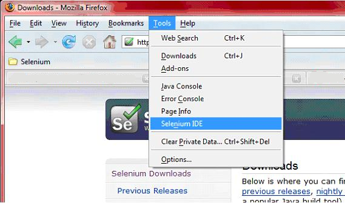
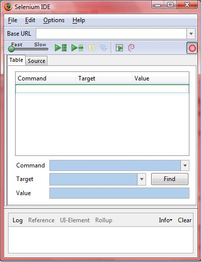
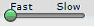
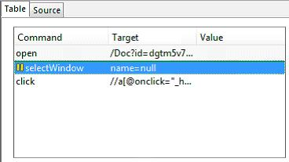
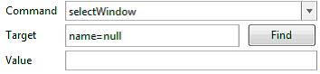
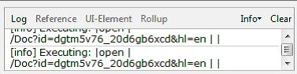

.. _chapter03-reference:

|logo| Developing Scripts With Selenium-IDE 
===========================================

Introduction 
------------

The Selenium-IDE (Integrated Development Environment) is the tool you use to 
develop your Selenium scripts.  Its an easy to use Firefox plug-in and is the 
generally the most efficient way to develop test scripts.  It also contains a 
context menu that allows you to first select a UI element from the browser's 
currently displayed page and then select from a list of Selenium commands 
with parameters pre-defined according to the context of the selected UI 
element.  This is not only a time-saver, but also an excellent way of 
learning Selenium script syntax. 
  
This chapter is all about the Selenuim IDE and how to use it effectively. 
  
Installing the IDE 
------------------

Using Firefox, first, download the IDE from the SeleniumHQ `downloads page`_
  
.. _`downloads page`: http://seleniumhq.org/download/
  
When downloading from Firefox, you'll be presented with the following window. 
 
.. image:: images/chapt3_img01_IDE_Installation.png
   :align: center

Select Install Now.  The Firefox Add-ons window pops up, first showing a 
progress bar, and when the download is complete, displays the following. 
  
.. image:: images/chapt3_img02_IDE_Installation.png
   :align: center
  
Restart Firefox.  After Firefox reboots you will find the Selnium-IDE listed under the Firefox Tools menu. 

Opening the IDE 
---------------

To run the Selenium-IDE, simply select it from the Firefox Tools menu.  It opens 
as follows with an empty script-editing window and a menu for loading, or 
creating new, your scripts. 
  
.. Darn!  I need to redo this.  No time now, gotta go!!!!

  
IDE Features  
------------

The File menu allows you to create, open and save test script and test suite 
files.  The Edit menu allows copy, paste, delete, undo and select all 
operations for editing the commands in your script.  The Options menu allows 
the changing of settings.  Specifically you can set the timeout value for 
certain commands, add user-defined user extensions to base set of Selenium 
commands, and you can specify the format (language) used when saving your 
scripts.  The Help menu is the standard Firefox Help menu.  The Selenium-IDE runs 
within a Firefox browser window and therefore displays the standard Firefox 
Help menu.  There is nothing specific to Selenium-IDE in the Help menu. 
  
The toolbar contains buttons for controlling the execution of your test 
scripts, including a step feature for debugging your scripts.  The right-most 
button, the one with the red-dot, is the record button.  
  

  
|speed control|
    Speed Control:  controls how fast your script runs. 
|run all|
    Run All: Runs the entire test suite when a test suite with multiple test 
    scripts is loaded. 
|run|
    Run:  Runs the currently selected test.  When only a single test is 
    loaded this button and the Run All button have the same effect.  
|pause resume|
    Pause/Resume:  Allows stopping and starting of a running script.
|step|
    Step:  Allows one to "step" through a script by running it one command at a 
    time.  Use for debugging scripts. 
|testrunner|
    TestRunner Mode:  Allows you to run the script in a browser loaded with 
    the Selenium-Core TestRunner.  The TestRunner is not commonly used now 
    and is likely to be deprecated.  This button is for evaluating scripts 
    for backwards compatibility with the TestRunner.  Most users will 
    probably not need this button.   
|rollup|
    Apply Rollup Rules: 

.. What is this?  Is this still used? Anyone know?

|record|
    Record:  Records the user's browser actions.  

.. |run| image:: images/chapt3_img08_Run.png

    
Your script is displayed in the following window.  It has two tabs, one for 
displaying the command and their parameters in a readable "table" format.  

  
The Source tab displays the script in the native format in which the file 
will be stored.  By default this is HTML although it can be changed to a 
programming language such as Java or C#, or a scripting language like Python.
See the Options menu for details.  The Source view also allows one to edit 
the script in it's raw form, including copy, cut and paste operations. 
  
The Command, Target, and Value entry fields display the currently selected 
command along with its parameters (if any).  These are entry fields where you 
can modify the currently selected command.  
  

  
If you start typing in the Command field, a drop-down list will be populated 
based on the first characters you type; you can then select your desired 
command from the drop-down. 
  
The bottom box displays the Log.  When you run your script, error messages, 
and information messages showing the progress of your script, are displayed 
here.  This is sometimes useful for script debugging.   Notice the Clear 
button for clearing the Log.  Also notice the Info button is a drop-down 
allowing selection of different levels of information to display.  
  

  
.. What is UI-Element and Rollup?  I tried these but they seem non-functional.  
   Are these new features not yet implemented or are they old features being 
   deprecated?  Anyone know?  If not, I'll post the question on the forums. 
     
Building Scripts  
----------------

There are three primary methods for developing scripts.  Frequently, a script 
developer will require all three techniques. 

Recording  
~~~~~~~~~

Many first-time users begin by recording a script from their interactions 
with a website.  When Selenium-IDE is first opened the record button is ON by 
default. 

.. note::
    This can be set to OFF as a default with an available user extension. 

.. Peter: Should "Recorder" be capitalized here?

The Recorder will automatically insert commands into your script based on 
your mouse clicks.  Typically, this will include:
  
* clicking a link - *click* or *clickAndWait* commands 
* entering values - *type* command 
* selecting options from a drop-down listbox - *select* command 
* click checkboxes or radio buttons - *click* command 
  
Here's some "gotchas" to be aware of:
  
* The *type* command may require clicking on some other area of the web page 
  for it to record. 
* Following a link usually records a *click* commands. You will often need to 
  change this to *clickAndWait* to ensure your script pauses until the new page 
  is completely loaded.  Otherwise, your script will continue running commands
  before the page has loaded all its UI elements. This will cause unexpected 
  script failures.
  
Adding Verifications and Asserts With the Context Menu 
~~~~~~~~~~~~~~~~~~~~~~~~~~~~~~~~~~~~~~~~~~~~~~~~~~~~~~
  
Your scripts will also need to check the properties of a web-page.  This 
requires *assert* and *verify* commands.  We won't describe the specifics of 
these commands here; that is in the chapter on :ref:`Selenium commands <chapter04-reference>`.  Here we'll 
simply describe how to add them to your script. 
  
With Selenium-IDE recording, go to the browser displaying your test application and 
right click anywhere on the page.  You will see a context menu showing *verify* 
and/or *assert* commands.  

.. TODO: add image here (it wasn't correctly uploaded in the GDocs version

The first time you use Selenium, there may only be one Selenium command listed.
As you use the IDE however, you will find additional commands will quickly be
added to this menu.  Selenium-IDE will attempt to predict what command, along 
with the parameters, you will need for a selected UI element on the current 
web-page. 
  
Let's see how this works. Open a web-page of your choosing and select a block 
of text on the page. A paragraph or a heading will work fine.  Now, right-click
the selected text.  The context menu should give you a *verifyTextPresent*
command and the suggested parameter should be the text itself. 
  
Also, notice the Show All Available Commands menu option.  This shows many, 
many more commands, again, along with suggested parameters, for testing your 
currently selected UI element. 
  
Try a few more UI elements. Try right-clicking an image, or a user control 
like a button or a checkbox.  You may need to use Show All Available Commands 
to see options other than *verifyTextPresent*. Once you select these other 
options, the more commonly used ones will show up on the primary context menu.
For example, selecting *verifyElementPresent* for an image should later cause 
that command to be available on the primary context menu the next time you 
select an image and right-click. 
  
Again, these commands will be explained in detail in the chapter on Selenium 
commands.  For now though, feel free to use the IDE to record and select 
commands into a script and then run the script.  You can learn a lot about 
the Selenium commands simply by experimenting though the IDE. 
  
Editing  
~~~~~~~

Insert Command 
++++++++++++++

Select the point in your script where you want to insert the command.  Right-
click and select Insert Command.  Now use the command editing text fields to 
enter your new command and its parameters. 
  
Insert Comment 
++++++++++++++

Comments may be added to make your script more readable.  These comments are 
ignored when the script is run.  Select the point in your script where you 
want to insert the comment.  Right-click and select Insert Comment.  Now use 
the first command editing text fields to enter the comment. 
  
Edit a Command or Comment 
+++++++++++++++++++++++++

Simply select the line to be changed and edit it using the command editing text
fields. 
    
Opening and Saving a Script 
~~~~~~~~~~~~~~~~~~~~~~~~~~~

The File-»Open, Save and Save As menu commands behave similar to opening and 
saving files in most other programs.  When you open an existing script, it 
loads that script file into the IDE and displays its Selenium commands in the 
main script editing window. 
  
Notice also that you can open and save test suite files.  Test suites will be 
discussed later in this section.  
  
.. note:: 
    At the time of writing there's a bug, where at times, when the IDE is 
    first opened and then you select File->Open, nothing happens.  If you see 
    this, close down the IDE and restart it (you don't need to close the 
    browser itself).  This will fix the problem. 
  
Running Scripts 
---------------
  
The IDE allows many options for running your script. You can run a script all
at once, stop and start it, run it one line at a time, run a single command 
you are current developing, and you can do a batch run of an entire test suite.
Execution of scripts is very flexible in the IDE. 
  
Run a Script
    Click the Run button to run the currently displayed script. 
  
Run a Test Suite
    Click the Run All button to run all the scripts in the currently loaded 
    test suite. 
  
Stop and Start
    The Pause button can be used to stop the script while it is running.  The 
    icon of this button then changes to indicate the Resume button.  To continue
    click Resume. 
  
Stop in the Middle
    You can set a breakpoint in the script to cause the script to stop on a 
    particular command.  This is useful for debugging your script. To set a 
    breakpoint, select a command, right-click, and from the context menu 
    select Toggle Breakpoint. 
  
Start from the Middle
    You can tell the IDE to begin running from a specific command in the 
    middle of the script.  This also is used for debugging.  To set a 
    startpoint, select a command, right-click, and from the context menu 
    select Set/Clear Start Point. 
  
Run Any Single Command
    Double-click any single command to run it by itself.  This is useful when 
    writing a single command.  It lets you immediately test a command you are 
    constructing, but not sure if it is correct.  You can double-click it to 
    see if it runs correctly.  This is also available from the context menu.
  
Debugging 
---------

Debugging means finding and fixing errors in your script.  This is a normal 
part of script development. 
  
We won't teach debugging here as most new users to Selenium will already have 
some basic experience with debugging.  If this is new to you, we recommend 
you ask one of the developers in your organization. 
  
Breakpoints and Startpoints 
~~~~~~~~~~~~~~~~~~~~~~~~~~~
  
The Sel-IDE supports the setting of breakpoints and the ability to start and 
stop the running of a script, from any point within the script.  That is, one 
can run up to a specific command in the middle of the script and inspect how 
the script behaves at that point.  To do this, set a breakpoint on the 
command just before the one to be examined.  
  
To set a breakpoint, select a command, right-click, and from the context menu 
select *Toggle Breakpoint*.  Then click the Run button to run your script from 
the beginning up to the breakpoint. 
  
It is also sometimes useful to run a script from somewhere in the middle to 
the end of the script or up to a breakpoint that follows the starting point.  
For example, suppose your script first logs into the website and then 
performs a series of tests and you are trying to debug one of those tests.  
However, you only need to login once, but you need to keep rerunning your 
tests as you are developing them.  You can login once, then run your script 
from a startpoint placed after the login portion of your script.  That will 
prevent you from having to manually logout each time you rerun your script. 
  
To set a startpoint, select a command, right-click, and from the context 
menu select *Set/Clear Start Point*.  Then click the Run button to execute the 
script beginning at that startpoint. 
  
Stepping Through a Script 
~~~~~~~~~~~~~~~~~~~~~~~~~
.. TODO: Fill this in--it should be real quick. 

Find Button 
~~~~~~~~~~~

The Find button is used to see which UI element on the currently displayed 
webpage (in the browser) is used in the currently selected Selenium command.  
This is useful when building a locator for a command's first parameter (see the
section on :ref:`locators <locators-section>` in the Selenium Commands chapter). It can be used with any
command that must identify a UI element on a webpage, i.e. *click*, 
*clickAndWait*, *type*, and the *assert* and *verify* commands among others. 
  
Select any command that must identify a UI element. Click the Find button.  
Now look on the webpage displayed in the Firefox browser.  

Page Source for Debugging 
~~~~~~~~~~~~~~~~~~~~~~~~~

Often, when debugging a script, you simply must look at the page source (the 
HTML for the webpage you're trying to test) to determine a problem.  Firefox 
makes this easy.  Simply, right-click the webpage and select Page Source.  
The HTML opens in a separate window.  Use its Search feature (F3 function key)
to search for a keyword to find the HTML for the UI element you're trying 
to test. 
  
Writing a Test Suite 
--------------------

A test suite is a collection of test scripts and is displayed in the left-most
pane in the IDE. Test scripts may be added to the list and deleted from it.  
Test suites may be opened and saved.  When a test suite is saved any changes 
to tests scripts within that suite are also saved. 
  
.. do some testing here of test suites—do they save correctly?
   I've seen errors in the past. 
  
User Extensions 
---------------

User extensions are javascript files that allow one to create their own 
customized and features to add additional functionality.  Often this is in 
the form of customized commands although this extensibility is not limited to 
additional commands.  User extensions are loaded by setting the path to user 
extension files through the Options menu. 
  
There are a number of useful extensions created by users available at the 
SeleniumHQ website. Also you'll find information on writing your own extensions.   

.. is this true or is the OpenQA still?

Format 
------

Format, under the Options menu, allows you to select a language for saving 
and displaying the script.  This is for supporting Selenium-RC.  The default 
is HTML and if you will only be running your Selenium scripts from the IDE 
you can ignore this feature. 
  
If, however, you will be using Selenium-RC to run your scripts, this is how 
you translate your test script into a programming language.  Select the 
language, i.e. Java, PHP, you will be using with Selenium-RC for developing 
your test programs.  Then simply save the scripts using File-»Save.  Your 
script will be translated into a series of functions in the language you 
choose.  Essentially, program code supporting your test is generated for you 
by Selenium-IDE. 
  
Also, note that if the generated code does not suit your needs, you can alter 
it by editing a configuration file which defines the generation process.  
Each supported language has configuration settings which are editable.  This 
is under Options->Options->Format tab. 
  
.. TODO: Add the steps here to change the format. 
  
.. note::
   At the time of writing, this feature is not yet supported by the Selenium 
   developers.  However the author has altered the C# format in a limited 
   manner and it has worked well. 
  
Summary 
-------
