.. _chapter05-reference:

|logo| Selenium-RC
==================

.. |logo| image:: images/selenium-rc-logo.png
   :alt:

When to Use Selenium-RC?
------------------------

Selenium-RC is the response for tests that need a little more than just simple
browser actions and a linear execution. Selenium-RC allows the users to use the 
full power of programming languages, creating tests that can do things like read
and write external files, make queries to a Data Base, send emails with test 
reports, practically anything a user can do with a normal application.

You can see some examples of this in the `Sample Test Scripts`_ section, where
we will explain how to develop complex tests and leverage the power of a real
programming language on them.

.. TODO: The content of sample test scripts section is not what is described
   here. For now I'm just explaining simple code on them.
   I'll try to add a last subsection like "Adding spice to your tests".

Basically, you will need to use Selenium-RC whenever your test requires logic
not supported by running a script from Selenium-IDE. What sort of logic could 
this be? For example, Selenium-IDE does not directly support:

* conditional statements 
* iteration 
* logging and reporting of test results
* error handling, particularly unexpected errors
* database testing
* test case grouping
* re execution of failed tests
* test case dependency
* capture screenshots on test failures

Though most of these are not supported by selenium inherently but can be achieved
by using language specific libraries. These would be explained in details in the
`Sample Test Scripts`_ section. 

.. Santi: I'm not sure if we'll be able to explain EVERY pont of these on that 
   section, some of them may even have a separate section.

.. note:: It may be possible to add this functionality by the addition of user 
   extensions to Selenium-IDE but most prefer to use Selenium-RC to gain all the
   flexibility of a programming language.

How Selenium Remote Control works
----------------------------------

.. Paul: I initiated a couple of forum posts that can shed some light here. 
   Some of the content in those posts can serve as descriptive info for us.
   This comment is a reminder for me to get that info off OpenQA.

Selenium-RC comes in two parts:

* A server which automatically launches and kills browsers, and acts as a HTTP
  proxy for web requests from them. 
* Client libraries for your favorite programming language, which communicate 
  with the server telling him what's next.

The RC server bundles Selenium Core, and automatically injects it into the 
browser within the Application Under Test.

Here is a simplified representation.... 

.. image:: images/chapt5_img01_Architecture_Diagram_Simple.png
   :align: center

As you can see on the illustration, the client libraries communicate with the
Server directly passing one by one the actions to execute. Then the server gives
this orders to the browser by the use of Selenium-Core javascript commands.

The Server receives commands directly using simple HTTP GET/POST requests;
that means that you can use any programming language that can make HTTP requests
to automate Selenium tests on the browser.

Proxy Injection vs. Hightened Privileges
~~~~~~~~~~~~~~~~~~~~~~~~~~~~~~~~~~~~~~~~~

.. note:: This topic tries to explain the technical implementation behind 
   Selenium-RC. It's not fundamental for a Selenium user to know this, but 
   could be useful for understanding some of the problems you can find in the
   future.
   
To understand in detail how Selenium-RC works  and why it uses proxy injection
and hightened privilege modes you must first understand `the same origin policy`_.
   
The Same Origin Policy
++++++++++++++++++++++
The main restriction that Selenium's architecture has faced is the 
Same Origin Policy. This security restriction is applied by every browser
in the market and it's objective is to ensure that a site's content will never
be accessible by a script from other site.

If this were possible, a script placed on any website you open, would 
be able to read information on your bank account if you had the account page
opened on other tab. Which is also called XSS (Cross-site Scripting).

To work under that policy. Selenium-Core (and it's javascript commands that
make all the magic happen) must be placed in the same origin as the Application
Under Test (same URL). This has been the way Selenium-Core was first
used and implemented (by deploying Selenium-Core and the set of tests inside
the application's server), but this was a requirement that not all the projects 
could meet and Selenium Developers had to find an alternative that would allow 
testers to use Selenium to test site where they didn't have the possibility to
deploy their code. 

.. note:: You can find additional information about this topic on wikipedia
   pages about `Same Origin Policy`_ and XSS_. 

.. _Same Origin Policy: http://en.wikipedia.org/wiki/Same_origin_policy
.. _XSS: http://en.wikipedia.org/wiki/Cross-site_scripting

Proxy Injection
+++++++++++++++
The first method used to skip the `The Same Origin Policy`_ was Proxy Injection.
In this method, the Selenium Server acts as a client-configured [1]_ **HTTP 
proxy** [2]_, that stands in between the browser and the Application Under Test.
After this, it is able to masks the whole AUT under a fictional URL (embedding
Selenium-Core and the set of tests and delivering them as if they were coming
from the same origin). 

.. [1] The proxy is a third person in the middle that passes the ball 
   between the two parts. In this case will act as a "web server" that 
   delivers the AUT to the browser. Being a proxy, gives the capability
   of "lying" about the AUT real URL.  
   
.. [2] The client browser (Firefox, IE, etc) is launched with a 
   configuration profile that has set localhost:4444 as the HTTP proxy, this
   is why any HTTP request that the browser does will pass through Selenium
   server and the response will pass through it and not from the real server.

Here is an architectural diagram. 

.. TODO: Notice: in step 5, the AUT should pass through the HTTPProxy to go to 
   the Browser....

.. image:: images/chapt5_img02_Architecture_Diagram.png
   :align: center

As a test suite starts in your favorite language, the following happens:

1. The client/driver establishes a connection with the selenium-RC server.
2. Selenium-Server launches a browser (or reuses an old one) with an URL that 
   will load Selenium-Core in the web page.
3. Selenium-RC gets the first instruction from the client/driver (via another 
   HTTP request made to the Selenium-RC Server).
4. Selenim-Core acts on that first instruction, typically opening a page of the
   AUT.
5. The server is asked for that page, and it renders in the frame/window 
   reserved for it.
   
.. TODO: I've got to update the image and the steps to include some of the 
   information that is missing (Server response to the libs, AUT passing through 
   the server, etc).
   
Hightened Privileges Browsers
+++++++++++++++++++++++++++++
This workflow on this method is very similar to Proxy Injection but the main
difference is that the browsers are launched in a special mode called *Hightened
Privileges*, which allows websites to do things that are not commonly permitted
(as doing XSS_, or filling file upload inputs and pretty useful stuff for 
Selenium). By using this browser modes, Selenium Core is able to directly open
the AUT and read/interact with it's content without having to pass the whole AUT
through the Selenium-RC server.

Here is the architectural diagram. 

.. image:: images/chapt5_img02_Architecture_Diagram.png
   :align: center

As a test suite starts in your favorite language, the following happens:

1. The client/driver establishes a connection with the Selenium-RC server.
2. Selenium-Server launches a browser (or reuses an old one) with an URL that 
   will load Selenium-Core in the web page.
3. Selenium-RC gets the first instruction from the client/driver (via another 
   HTTP request made to the Selenium-RC Server).
4. Selenim-Core acts on that first instruction, typically opening a page of the
   AUT.
5. The server is asked for that page, and it renders in the frame/window 
   reserved for it.
   
.. TODO: I've got to update the image and the steps to include some of the 
   information that is missing (Server response to the libs, etc).
   
.. TODO: Call for review on the Devs list once I finish this topic!!!

Relationship between Client libs and Selenese
---------------------------------------------

.. TODO: Mary Ann pointed out this and I think is very important:
   Info about the individual language APIs for RC being "wrappers" for the
   Selenese commands covered in the chapter.  We need to make clear that
   everyone needs to understand Selenese, but that in order to write a
   Perl/Selenium test (for example), one must also familiarize oneself
   with the Perl/Selenium API.  I recommend that we have a completed
   version of the sketched table below, only with parameter lists added
   for all command cells (including the first row):

.. Selenese    type    click    verifyTextPresent    assertAlert
   Java
   Perl
   C#
   Python
   PHP
   etc.

Installation
------------

Once you dowload the whole Selenium-RC zip file from the `downloads page`_ you
will notice that it has lots of subfolders inside. As you already know from
the `How Selenium Remote Control Works`_, this folders have all the subparts
that integrates the RC.

Once you've chosen a language to work with, you'll only need to install the 
server and the client driver you need.

Selenium server installation
~~~~~~~~~~~~~~~~~~~~~~~~~~~~

The Selenium-RC server is just a jar file, which doesn't need installation at
all. Just be downloading the zip file and extracting the server in the desired
directory should be enough. You just go to that directory and execute it using
java:: 

    java -jar selenium-server.jar

Most people like to have a more simplified setup, which can be made by creating
an executable batch file (.bat on windows and .sh on linux) with just the line
write above. This way, you can make a shortcut to that executable file in your
desktop and just double-click on it anytime you want to wake up the server.

Java client driver configuration
~~~~~~~~~~~~~~~~~~~~~~~~~~~~~~~~

.. Santi: I found this link and thought it could be useful:
   http://epyramid.wordpress.com/2008/11/26/setting-up-selenium-rc-testng-using-eclipse/

In General configuration of Selenium-RC with any java IDE would have following 
steps:

* Download Selenium-RC from the SeleniumHQ `downloads page`_ 
* Start any java IDE
* Create new project
* Add to your project classpath selenium-java-client-driver.jar 
* Record your test to from Selenium-IDE and translate it to java code (Selenium
  IDE has automation translation feature)
* Run selenium server from console (You need initialized java environment 
  variable to do this) like:

.. code-block:: bash

   $ java -jar selenium-server -proxyInjectionMode. 

.. note:: Server can be started from java as well.

* Run your test in the IDE

These points have been delineated below with reference to Eclipse and IntelliJ: 

Configuring Selenium-RC With Eclipse
++++++++++++++++++++++++++++++++++++

**Eclipse** is a multi-language software development platform comprising an IDE 
and a plug-in system to extend it. It is written primarily in Java and is used 
to develop applications in this language and, by means of the various plug-ins, 
in other languages as well as C/C++, Cobol, Python, Perl, PHP and more.

Following lines describes configuration of Selenium-RC with Eclipse - 
Version: 3.3.0. (Europa Release). It should not be too different for higher 
versions of Eclipse 

* Launch Eclipse. 
* Select File > New > Other. 

.. image:: images/chapt5_img03_Launch_Eclipse.png
   :align: center

* Java > Java Project > Next 

.. image:: images/chapt5_img04_Create_Java_Project.png
   :align: center

* Provide Name to your project, Select JDK in 'Use a project Specific JRE' option (JDK 1.5
  selected in this example) > click Next 

.. image:: images/chapt5_img05_Create_Java_Project.png
   :align: center

* Keep 'JAVA Settings' intact in next window. Project specific libraries can be 
  added here. (This described in detail in later part of document.)

.. image:: images/chapt5_img06_Create_Java_Project.png 
   :align: center

* Click Finish > Click on Yes in Open Associated Perspective pop up window. 

.. image:: images/chapt5_img07_Create_Java_Project.png 
   :align: center

This would create Project Google in Package Explorer/Navigator pane.

.. image:: images/chapt5_img08_Package_Explorer.png 
   :align: center

* Right click on src folder and click on New > Folder 

.. image:: images/chapt5_img09_Create_Com_Package.png 
   :align: center

Name this folder as com and click on Finish button.

* This should get com package insider src folder. 

.. image:: images/chapt5_img10_Create_Com_Package.png 
   :align: center

* Following the same steps create *core* folder inside *com*

.. image:: images/chapt5_img11_Create_Core_Package.png 
   :align: center

SelTestCase class can be kept inside *core* package. 

Create one more package inside *src* folder named *testscripts*. This is a 
place holder for test scripts. 

*Please notice this is about the organization of project and it entirely 
depends on individual's choice /  organization's standards. Test scripts 
package can further be segregated depending upon the project requirements.*

.. image:: images/chapt5_img12_Create_Test_Script_Package.png 
   :align: center

* Create a folder called lib inside project Google. Right click on Project name
  > New > Folder. This is a place holder for jar files to project (i.e. Selenium 
  client driver, selenium server etc) 

.. image:: images/chapt5_img13_Create_Library_Package.png
   :align: center

This would create lib folder in Project directory. 

.. image:: images/chapt5_img14_Create_Library_Package.png
   :align: center

* Right click on *lib* folder > Build Path > Configure build Path 

.. image:: images/chapt5_img15_Configure_Build_Path.png
   :align: center

* Under Library tab click on Add External Jars to navigate to directory where 
  jar files are saved. Select the jar files which are to be added and click on 
  Open button. 

.. image:: images/chapt5_img16_Configure_Build_Path.png
   :align: center

.. note: Here in Selenium Server, Selenium Java Client driver and TestNG jar 
   files have been added. TestNG is a testing framework which can be used to
   build selenium tests. As an alternative to TestNG, JUnit jar can be added to
   write selenium tests. 

After having added jar files click on OK button. 

.. image:: images/chapt5_img17_Configure_Build_Path.png
   :align: center

Added libraries would appear in Package Explorer as following:

.. image:: images/chapt5_img18_Configure_Build_Path.png
   :align: center

Configuring Selenium-RC With Intellij
+++++++++++++++++++++++++++++++++++++

**IntelliJ IDEA** is a commercial Java IDE by the company JetBrains. Intellij 
provides a set of integrated refactoring tools that allow programmers to 
quickly redesign their code. IntelliJ IDEA provides close integration with 
popular open source development tools such as CVS, Subversion, Apache Ant and 
JUnit.

Following lines describes configuration of Selenium-RC with IntelliJ 6.0
It should not be very different for higher version of intelliJ.

* Open a New Project in IntelliJ IDEA.

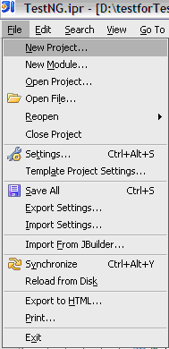
     
* Provide name and location to Project.

.. image:: images/chapt5_img28_Name_Project.png
   :align: center
   
* Click Next and provide compiler output path.

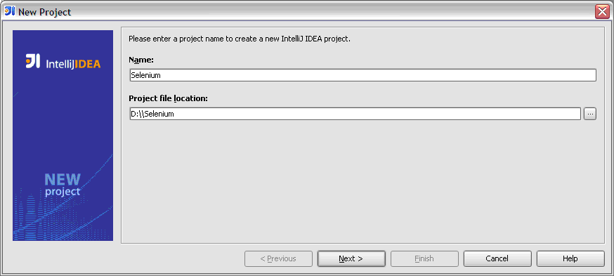
   
* Click Next and select the JDK to be used.   

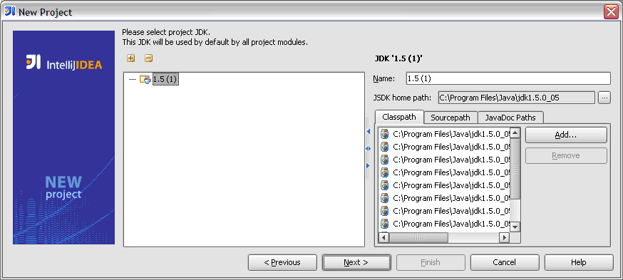

* Click Next and select Single Module Project.

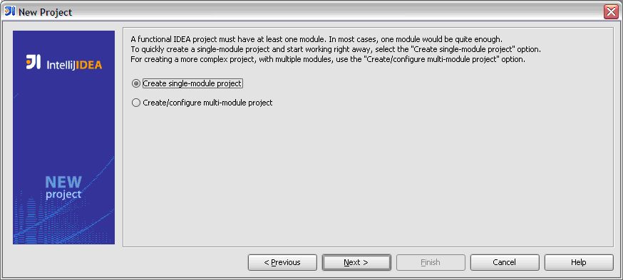
   
* Click Next and select Java module.

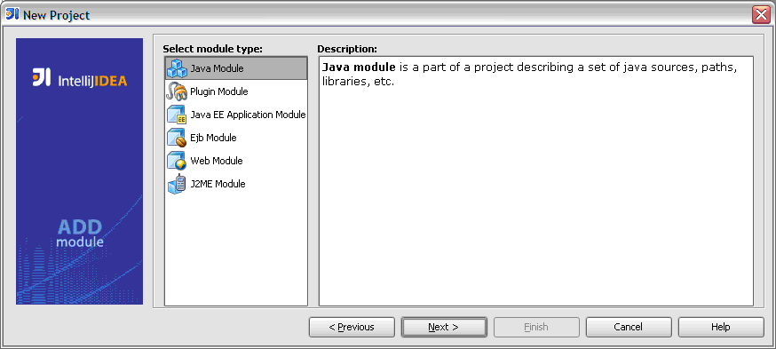

* Click Next and provide Module name and Module content root.

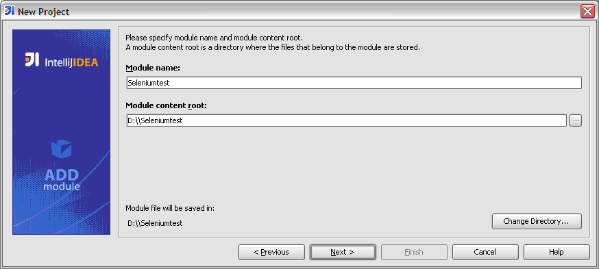
   

* Click Next and select Source directory.   

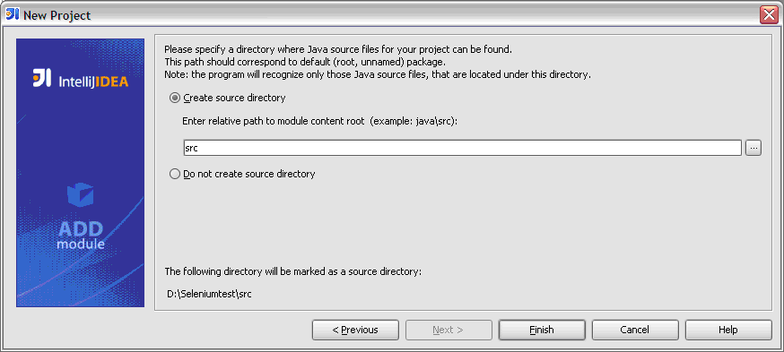
   
* At last click Finish. This will launch the Project Pan.

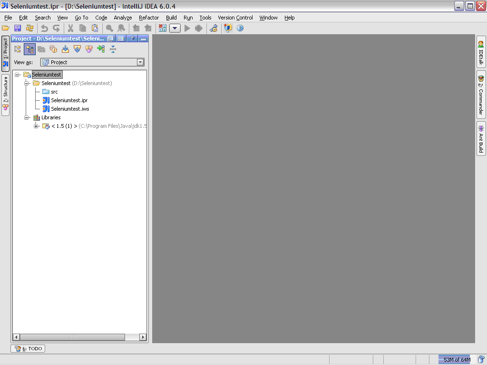
   

**Adding Libraries to Project:**

* Click on *Settings* button in the Project Tool bar.

.. image:: images/chapt5_img35_Add_Lib.png
   :align: center

* Click on *Project Structure* in Settings pan. 

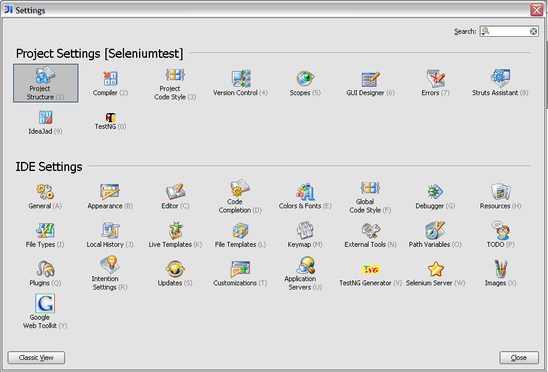
   
* Select *Module* in Project Structure and browse to *Dependencies* tab.   

.. image:: images/chapt5_img37_Dependencies.png
   :align: center
   
* Click on Add button followed by click on Module Library.  

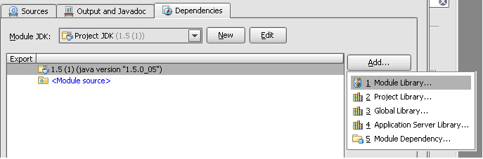

* Browse to the Selenium directory and select selenium-java-client-driver.jar 
  and selenium-server.jar. (Multiple Jars can be selected b holding down the 
  control key.). 

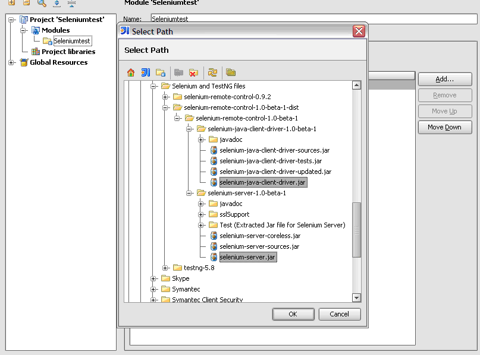
   
* Select both jar files in project pan and click on *Apply* button.   

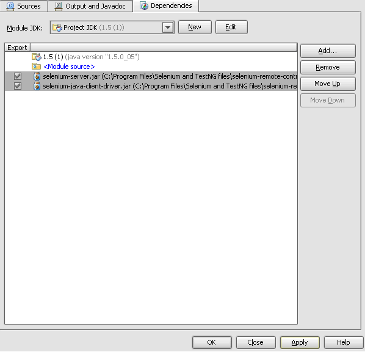
   
   
* Now click ok on Project Structure followed by click on Close on 
  Project Settings pan. Added jars would appear in project Library as following.    

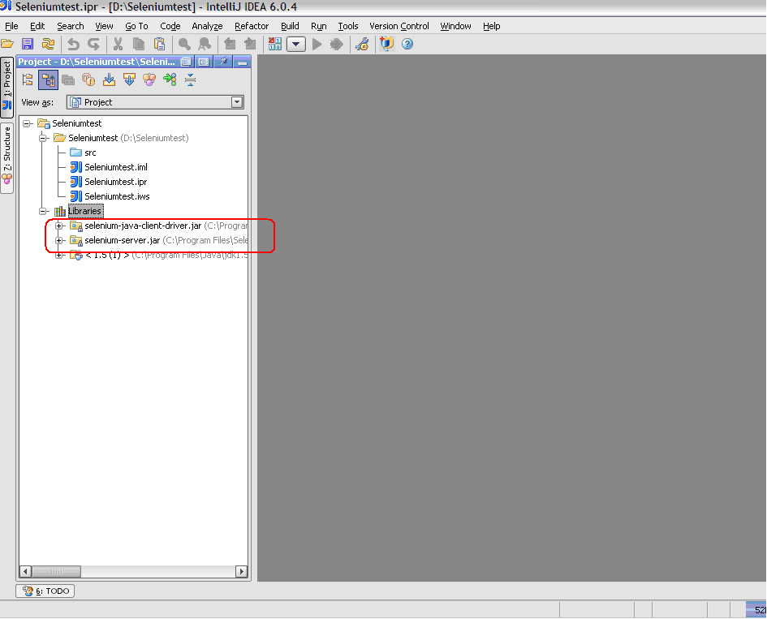
   
* Create the directory structure in src folder as following.   

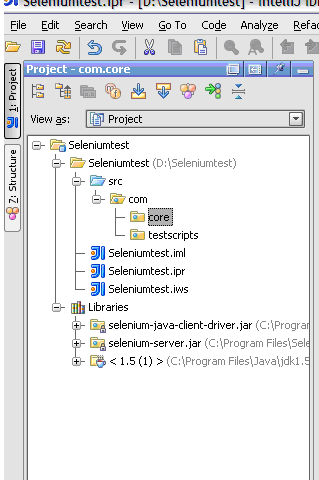
   
.. note:: This is not hard and fast convention and might very from project to
   project.

* Herein *core* contains the SelTestCase class which is used to create 
  Selenium object and fire up the browser. *testscripts* package contains 
  the test classes which extend the SelTestCase class. Hence extended 
  structure would look as following.
  
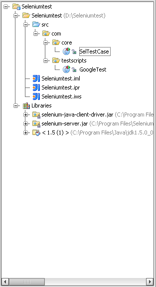
   

.. <Documentation is in progress> 

Python Client Driver Configuration 
~~~~~~~~~~~~~~~~~~~~~~~~~~~~~~~~~~

The following steps describe the basic installation procedure. After following 
this, the user can start using the desired IDE, (even write tests in a text 
processor and run them from command line!) without any extra work (at least 
from the selenium's part).

* Installing Python

    .. note:: This will cover python installation on Windows and Mac only, as 
       in most linux distributions python is already pre-installed by default. 

    * Windows
    
      1. Download Active python's installer from ActiveState's official site: 
         http://activestate.com/Products/activepython/index.mhtml 
      2. Run the installer downloaded (ActivePython-x.x.x.x-win32-x86.msi)

..

      .. image:: images/chapt5_img19_Python_Install.png
         :align: center

..

      .. image:: images/chapt5_img22_Python_Install.png
         :align: center

..

    * Mac
    
      The latest Mac OS X version (Leopard at this time) comes with Python 
      pre-installed. To install an extra Python, get a universal binary at 
      http://www.pythonmac.org/ (packages for Python 2.5.x). You will get a 
      .dmg file that you can mount. It contains a .pkg file that you can launch.

      .. image:: images/chapt5_img19_Python_Mac_Install.png
         :align: center
	
* Installing the Selenium driver client for python 

    1. Download the last version of Selenium Remote Control from the 
       `downloads page`_
    2. Extract the content of the downloaded zip file 
    3. Copy the module with the Selenium's driver for Python (selenium.py)
       in the folder *C:/Python25/Lib* (this will allow you to import it 
       directly in any script you write).

       You will find the module in the extracted folder, it's located inside 
       *selenium-python-driver-client*.

    .. image:: images/chapt5_img25_Python_Driver_Install.png
       :align: center

Congratulations, you're done! Now any python script that you create can import
selenium and start interacting with the browsers.

.. _`downloads page`: http://seleniumhq.org/download/

.NET client driver configuration
~~~~~~~~~~~~~~~~~~~~~~~~~~~~~~~~

.NET client Driver can be used with Microsoft Visual Studio. 
To Configure it with Visual do as Following.

* Launch Visual Studio and navigate to File > New > Project.
  
  .. image:: images/chapt5_img01_Launch_VisualStudio.png
     :align: center
      
..

* Select Visual C# > Class Library > Name your project > Click on OK button.

  .. image:: images/chapt5_img02_CreateProject.png
     :align: center
  
..

* A Class (.cs) is created. Rename it as appropriate.

  .. image:: images/chapt5_img03_TestClassFile.png
    :align: center

..

* Under right hand pane of Solution Explorer right click on References > Add
  References. 

  .. image:: images/chapt5_img04_AddReference.png
    :align: center

..

*  Select following dll files - 
   nmock.dll, nunit.core.dll, nunit.framework.dll,ThoughtWorks.
   Selenium.Core.dll, ThoughtWorks.Selenium.IntegrationTests.dll,
   ThoughtWorks.Selenium.UnitTests.dll and click on Ok button
   
   .. image:: images/chapt5_img05_AddDlls.png
      :align: center
      
With This Visual Studio is ready for Selenium Test Cases.
For a sample test case in C# look at `C# section`_ of Basic Tests Structure

.. _`C# section`: `C#`_
  

Sample Test Scripts
-------------------

If we use the following test recorded with Selenium-IDE as a base:

.. _search example:

=================  ============  ===========
open               /
type               q             selenium rc
clickAndWait       submit
assertTextPresent  Selenium-RC
=================  ============  ===========

.. note:: In the table is not mentioned that the script is written to test 
   a search at http://www.google.com

Here is the test script exported to all the programming languages:

.. container:: toggled

   .. code-block:: c#

        using System;
        using System.Text;
        using System.Text.RegularExpressions;
        using System.Threading;
        using NUnit.Framework;
        using Selenium;

        namespace SeleniumTests
        {
        	[TestFixture]
        	public class NewTest
        	{
        		private ISelenium selenium;
        		private StringBuilder verificationErrors;
        		
        		[SetUp]
        		public void SetupTest()
        		{
        			selenium = new DefaultSelenium("localhost", 4444, "*firefox", "http://www.google.com/");
        			selenium.Start();
        			verificationErrors = new StringBuilder();
        		}
        		
        		[TearDown]
        		public void TeardownTest()
        		{
        			try
        			{
        				selenium.Stop();
        			}
        			catch (Exception)
        			{
        				// Ignore errors if unable to close the browser
        			}
        			Assert.AreEqual("", verificationErrors.ToString());
        		}
        		
        		[Test]
        		public void TheNewTest()
        		{
        			selenium.Open("/");
        			selenium.Type("q", "selenium rc");
        			selenium.Click("submit");
        			selenium.WaitForPageToLoad("30000");
        			Assert.IsTrue(selenium.IsTextPresent("Selenium-RC"));
        		}
        	}
        }

.. container:: toggled

   .. code-block:: java

      package com.example.tests;

      import com.thoughtworks.selenium.*;
      import java.util.regex.Pattern;

      public class NewTest extends SeleneseTestCase {
      	public void setUp() throws Exception {
      		setUp("http://www.google.com/", "*firefox");
      	}
            public void testNew() throws Exception {
      	      selenium.open("/");
      	      selenium.type("q", "selenium rc");
      	      selenium.click("submit");
      	      selenium.waitForPageToLoad("30000");
      	      assertTrue(selenium.isTextPresent("Selenium-RC"));
      	}
      }

.. container:: toggled

   .. code-block:: perl

      use strict;
      use warnings;
      use Time::HiRes qw(sleep);
      use Test::WWW::Selenium;
      use Test::More "no_plan";
      use Test::Exception;

      my $sel = Test::WWW::Selenium->new( host => "localhost", 
                                          port => 4444, 
                                          browser => "*firefox", 
                                          browser_url => "http://www.google.com/" );

      $sel->open_ok("/");
      $sel->type_ok("q", "selenium rc");
      $sel->click_ok("submit");
      $sel->wait_for_page_to_load_ok("30000");
      $sel->is_text_present_ok("Selenium-RC");

.. container:: toggled

   .. code-block:: php

      <?php

      require_once 'PHPUnit/Extensions/SeleniumTestCase.php';

      class Example extends PHPUnit_Extensions_SeleniumTestCase
      {
        function setUp()
        {
          $this->setBrowser("*firefox");
          $this->setBrowserUrl("http://www.google.com/");
        }

        function testMyTestCase()
        {
          $this->open("/");
          $this->type("q", "selenium rc");
          $this->click("submit");
          $this->waitForPageToLoad("30000");
          $this->assertTrue($this->isTextPresent("Selenium-RC"));
        }
      }
      ?>

.. container:: toggled

   .. code-block:: python

      from selenium import selenium
      import unittest, time, re

      class NewTest(unittest.TestCase):
          def setUp(self):
              self.verificationErrors = []
              self.selenium = selenium("localhost", 4444, "*firefox",
                      "http://www.google.com/")
              self.selenium.start()
         
          def test_new(self):
              sel = self.selenium
              sel.open("/")
              sel.type("q", "selenium rc")
              sel.click("submit")
              sel.wait_for_page_to_load("30000")
              self.failUnless(sel.is_text_present("Selenium-RC"))
         
          def tearDown(self):
              self.selenium.stop()
              self.assertEqual([], self.verificationErrors)

.. container:: toggled

   .. code-block:: ruby

      require "selenium"
      require "test/unit"

      class NewTest < Test::Unit::TestCase
        def setup
          @verification_errors = []
          if $selenium
            @selenium = $selenium
          else
            @selenium = Selenium::SeleniumDriver.new("localhost", 4444, "*firefox", "http://www.google.com/", 10000);
            @selenium.start
          end
          @selenium.set_context("test_new")
        end

        def teardown
          @selenium.stop unless $selenium
          assert_equal [], @verification_errors
        end

        def test_new
          @selenium.open "/"
          @selenium.type "q", "selenium rc"
          @selenium.click "submit"
          @selenium.wait_for_page_to_load "30000"
          assert @selenium.is_text_present("Selenium-RC")
        end
      end

Now we will analyze the different parts of the tests for you to understand
each statement.

Basic Tests Structure
~~~~~~~~~~~~~~~~~~~~~

Here you will find an explanation of the basic test structure on each 
programming language. This tends to differ from one to another, so you'll find
separate explanations for each of them:

* `C#`_
* Java_
* Perl_
* PHP_ 
* Python_
* Ruby_ 

C#
++

.NET Client Driver works with Microsoft.NET.
It can be used together with any .NET testing framework 
like NUnit or the Visual Studio 2005 Team System.

.. code-block:: c#

	using System;
	using System.Text;
	using System.Text.RegularExpressions;
	using System.Threading;
	using NUnit.Framework;
	using Selenium;
	
	namespace SeleniumTests

	{
	    [TestFixture]

	    public class NewTest

	    {
		private ISelenium selenium;

		private StringBuilder verificationErrors;

		[SetUp]

		public void SetupTest()

		{
		    selenium = new DefaultSelenium("localhost", 4444, "*iehta",
		    "http://www.google.com/");

		    selenium.Start();

		    verificationErrors = new StringBuilder();
		}

		[TearDown]

		public void TeardownTest()
		{
		    try
		    {
			selenium.Stop();
		    }

		    catch (Exception)
		    {
			// Ignore errors if unable to close the browser
		    }

		    Assert.AreEqual("", verificationErrors.ToString());
		}
		[Test]

		public void TheNewTest()
		{
		    // Open Google search engine.		
		    selenium.Open("http://www.google.com/"); 
		    
		    // Assert Title of page.
		    Assert.AreEqual("Google", selenium.GetTitle());
		    
		    // Provide search term as "Selenium OpenQA"
		    selenium.Type("q", "Selenium OpenQA");
		    
		    // Read the keyed search term and assert it.
		    Assert.AreEqual("Selenium OpenQA", selenium.GetValue("q"));
		    
		    // Click on Search button.
		    selenium.Click("btnG");
		    
		    // Wait for page to load.
		    selenium.WaitForPageToLoad("5000");
		    
		    // Assert that "www.openqa.org" is available in search results.
		    Assert.IsTrue(selenium.IsTextPresent("www.openqa.org"));
		    
		    // Assert that page title is - "Selenium OpenQA - Google Search"
		    Assert.AreEqual("Selenium OpenQA - Google Search", 
		    		     selenium.GetTitle());
		}
	    }
	}

Java
++++

For java, we use a wrapper_ of the basic Junit test case. With it, you'll save
many lines of code by just writing the basic part and letting the wrapper do
all the rest.

.. _wrapper: http://release.seleniumhq.org/selenium-remote-control/1.0-beta-2/doc/java/com/thoughtworks/selenium/SeleneseTestCase.html

.. code-block:: java

   package com.example.tests;
   // We specify the package of our tess

   import com.thoughtworks.selenium.*;
   // This is the driver's import, you'll use this for instantiating a
   // browser and make it do what you need.

   import java.util.regex.Pattern;
   // Selenium-IDE add the Pattern module because it's sometimes used for 
   // regex validations. You can remove the module if it's not used in your 
   //script.

   public class NewTest extends SeleneseTestCase {
   // We create our selenium test case

         public void setUp() throws Exception {
   		setUp("http://www.google.com/", "*firefox");
                // We instantiate and start the browser
         }

         public void testNew() throws Exception {
              selenium.open("/");
              selenium.type("q", "selenium rc");
              selenium.click("submit");
              selenium.waitForPageToLoad("30000");
              assertTrue(selenium.isTextPresent("Selenium-RC"));
              // These are the real test steps
        }
   }

Perl
++++

PHP
+++

Python
++++++

We use pyunit testing framework (the unittest module) for our tests, you should
understand how this works to better understand how to write your tests.
To completely understand pyunit, you should read it's `official documentation
<http://docs.python.org/library/unittest.html>`_.

The basic test structure is:

.. code-block:: python

   from selenium import selenium
   # This is the driver's import, you'll use this class for instantiating a
   # browser and make it do what you need.

   import unittest, time, re
   # This are the basic imports added by Selenium-IDE by default.
   # You can remove the modules if they are not used in your script.

   class NewTest(unittest.TestCase):
   # We create our unittest test case

       def setUp(self):
           self.verificationErrors = []
           # This is an empty array where we will store any verification errors
           # we find in our tests

           self.selenium = selenium("localhost", 4444, "*firefox",
                   "http://www.google.com/")
           self.selenium.start()
           # We instantiate and start the browser

       def test_new(self):
           # This is the test code, here you should put the actions you need
           # the browser to do during your test
            
           sel = self.selenium
           # We assign the browser to the variable "sel" (just to save us from 
           # typing "self.selenium" each time we want to call the browser).
            
           sel.open("/")
           sel.type("q", "selenium rc")
           sel.click("submit")
           sel.wait_for_page_to_load("30000")
           self.failUnless(sel.is_text_present("Selenium-RC"))
           # These are the real test steps

       def tearDown(self):
           self.selenium.stop()
           # we close the browser (I'd recommend you to comment this line while
           # you are creating and debugging your tests)

           self.assertEqual([], self.verificationErrors)
           # And make the test fail if we found that any verification errors
           # where found

Ruby
++++

Starting The Browser 
~~~~~~~~~~~~~~~~~~~~~

.. container:: toggled

   .. code-block:: c#

      selenium = new DefaultSelenium("localhost", 4444, "*firefox", "http://www.google.com/");
      selenium.Start();

.. container:: toggled

   .. code-block:: java

      setUp("http://www.google.com/", "*firefox");

.. container:: toggled

   .. code-block:: perl

      my $sel = Test::WWW::Selenium->new( host => "localhost", 
                                          port => 4444, 
                                          browser => "*firefox", 
                                          browser_url => "http://www.google.com/" );

.. container:: toggled

   .. code-block:: php

      $this->setBrowser("*firefox");
      $this->setBrowserUrl("http://www.google.com/");

.. container:: toggled

   .. code-block:: python

      self.selenium = selenium("localhost", 4444, "*firefox",
                               "http://www.google.com/")
      self.selenium.start()

.. container:: toggled

   .. code-block:: ruby

      if $selenium
        @selenium = $selenium
      else
        @selenium = Selenium::SeleniumDriver.new("localhost", 4444, "*firefox", "http://www.google.com/", 10000);
        @selenium.start

Each of this sentences is in charge of instantiating a browser (which is just
an object for your code) and assigning the "browser" instance to a variable 
(which will later be used to call methods from the browser, like *open* or 
*type*)

The initial parameters that you should give when you create the browser instance
are: 

host
    This is the ip location where the server is located. Most of the times is
    the same machine than the one where the client is running, so you'll see
    that it's an optional parameter on some clients.
port
    As the host, it determines on which socket is the server listening waiting
    for the client to communicate with him. Again, it can be optional in some
    client drivers.
browser
    The browser in which you want to run the tests. This is a required 
    parameter (I hope you understand why :))
url
    The base url of the application under test. This is also required on all the
    client libs and Selenium-RC needs it before starting the browser due to the
    way the same server is implemented.

Finally, some languages require the browser to be started explicitly by calling
it's *start* method.

Running Commands 
~~~~~~~~~~~~~~~~

Once you have the browser initialized and assigned to a variable (generally
named selenium) you can make it run commands by calling the respective 
methods from the selenium browser. For example, when you call the *type* method
of the selenium object::

    selenium.type("field-id","sting to type")

In backend (by the magic of Selenium-RC), the browser will actually **type** 
using the locator and the string you specified during the method call. So, 
summarizing, what for your code is just a regular object (with methods and 
properties), in backend it's making the real browser do things.

Retrieving and Reporting Results
~~~~~~~~~~~~~~~~~~~~~~~~~~~~~~~~

Adding Some Spice to Your Tests
~~~~~~~~~~~~~~~~~~~~~~~~~~~~~~~~

Now you'll understand why you needed Selenium-RC and you just couldn't stay
only with the IDE. We will try to give you some guidance on things that can 
only be done using a programming language. The different examples are just 
written on only one of the languages, but we think that you'll understand the
idea and will be able to translate it to the language of your choice.

Iteration
+++++++++

Iteration is one of the most common things people needs to do in their tests.
Generally, to repeat a simple search, or saving you from duplicating the same
code several times.

If we take the `search example`_ we've been looking at, it's not so crazy to 
think that we want to check that all the Selenium tools appear on the search
we make. This kind of test could be made doing the following using Selenese:

=================  =============  =============
open               /
type               q              selenium rc
clickAndWait       submit
assertTextPresent  Selenium-RC
type               q              selenium ide
clickAndWait       submit 
assertTextPresent  Selenium-IDE 
type               q              selenium grid
clickAndWait       submit 
assertTextPresent  Selenium-Grid 
=================  =============  =============

As you can see, the code has been triplicated to run the same steps 3 times.
This doesn't look to efficient.

By using a programming language, we can just iterate over a list and do the 
search in the following way. 

**In Python:**

.. code-block:: python

   list = ("IDE", "RC", "GRID")
   for tool in list:
       sel.open("/")
       sel.type("q", "selenium " + tool)
       sel.click("submit")
       sel.wait_for_page_to_load("30000")
       self.failUnless(sel.is_text_present("Selenium-" + tool))
       
**In Java:**       
       
.. code-block:: java    

   // Collection of String values.	
   String[] arr = {"IDE", "RC", "GRID"};	
		
   // Execute For loop for each String in 'arr' array.
   for (String s:arr) {
   	sel.open("/");
  	sel.type("q", "selenium " +s);
   	sel.click("submit");
        sel.waitForPageToLoad("30000");
        verifyTrue("Expected text: " +s+ " is missing on page."
        , sel.isTextPresent("Selenium-" + s));
   
   }
   
**In C#:**   
   
.. code-block:: c#

   // Collection of String values.	
   String[] arr = {"IDE", "RC", "GRID"};	
		
   // Execute For loop for each String in 'arr' array.
   foreach (String s in arr) {
   	sel.open("/");
  	sel.type("q", "selenium " +s);
   	sel.click("submit");
        sel.waitForPageToLoad("30000");
        assertTrue("Expected text: " +s+ " is missing on page."
        , sel.isTextPresent("Selenium-" + s));
   
   }

			

Data Driven Testing
+++++++++++++++++++

So, the iteration_ idea seems cool. Let's improve this by allowing the users to
write an external text file from which the script should read the input data,
search and assert it's existence.

.. TODO: The script for this example

As you can see, this task looks really simple being made using a scripting
language while it's impossible to do using Selenium-IDE.

Error Handling
++++++++++++++

Most common errors encountered while running selenium test are
the errors which pop up when corresponding element locator is not available
on page. For ex.

.. code-block:: java
   
   selenium.type("q", "selenium " +s);
   
If element 'q' happens to be unavailable on page then following exception is thrown -

.. code-block:: java

   com.thoughtworks.selenium.SeleniumException: ERROR: Element q not found

A better approach would be to create custom methods for web application 
controls and having these methods being available to test methods using Inheritance
feature of Object Oriented Programming. A custom method for typing in text box 
might look as following -

.. code-block:: java
   
   public void typeAction(String elementLocator, String testData) {
		
		// If element is available on page then perform type operation.
		if(selenium.isElementPresent(elementLocator)) {
			
			selenium.type(elementLocator, testData);			
		
		// Else log the error in test report.
		
		}  else {		
			
			Reporter.log("Element: " +elementLocator+ 
			"is not available on page.");
		}
   }
   

*Above example is specific to java client driver which uses 'Reporter' 
class of TestNG for logging. Using the same approach corresponding method 
can be written in a variety of Selenium Client Drivers.*

Instead of typing value directly using 'type' method of selenium, 
'typeAction' method is called. Definition of 'typeAction' method
makes sure that 'type' method of selenium is used only when
corresponding element locator is available on page. Call to 
typeAction method would be - 

.. code-block:: java

   typeAction("username", "MyUserName");

Conditionals
++++++++++++

Well, the iteration and data input seem nice, but we've just started. How
about alternative paths? What if we want our script to change to the next
page if it finds that the search term was not present in the first one?

That doesn't seem too complicated:

.. TODO: The script for this example

By just using a simple *if* condition, we can do interesting things. Think of
the possibilities!

Data Base Validations
+++++++++++++++++++++

Off course, you can also do Data Base queries in your favorite scripting 
language. Why not using them for some data validations/retrieval on the application
under test?

Consider example of Registration process where in registered email address
is to be retrieved from database. Specific cases of establishing DB connection 
and retrieving data from DB would be -

**In Java:**

.. code-block:: java

   // Load Microsoft SQL Server JDBC driver.   
   Class.forName("com.microsoft.sqlserver.jdbc.SQLServerDriver");
      
   // Prepare connection url.
   String url = "jdbc:sqlserver://192.168.1.180:1433;DatabaseName=TEST_DB";
   
   // Get connection to DB.
   public static Connection con = 
   DriverManager.getConnection(url, "username", "password");
   
   // Create statement object which would be used in writing DDL and DML 
   // SQL statement.
   public static Statement stmt = con.createStatement();
   
   // Send SQL SELECT statements to the database via the Statement.executeQuery
   // method which returns the requested information as rows of data in a 
   // ResultSet object.
   
   ResultSet result =  stmt.executeQuery
   ("select top 1 email_address from user_register_table");
   
   // Fetch value of "email_address" from "result" object.
   String emailaddress = result.getString("email_address");
   
   // Use the fetched value to login to application.
   selenium.type("userid", emailaddress);
   
This is very simple example of of data retrieval from DB in Java.
A more complex test could be to validate that inactive users are not able
to login to application. Continuing with previous code 
block it could be written as following -

.. code-block:: java

   ResultSet result = stmt.executeQuery
   ("select email_address from usertable where user_activation = false");
   
   // Counter of number of inactive users.
   int count = 0;
   
   // ResultSet is examined row by row using ResultSet.next() method.
   while (result.next()) {
    count++;
    String emailaddress = result.getString("email_address");
    selenium.type("userid", emailaddress);
    selenium.click("login");
    selenium.waitForPageToLoad();
    verifyTryue("Exception message for invalid login is not thrown",
    	selenium.isTextPresent("Invalid UserId"));
   }
   
   // If count of invalid users is 0 then report it in test result.
   if (count == 0) {
   Reporter.log("There is no invalid use in db.");
   
   // Else report the count of users for whom invalid login was tested.
   } else {
    Reporter.log("Login invalidation was tested for: " +count+ " users.");
   }
   
   

Server Command Line options
---------------------------

.. Paul: Can we put some info in here about how/when a user would use some of 
   these features?  Some, like the port, should be obvious. But let's see if
   we can think of some examples. 
   Like.....Why would I ever want -singleWindow?  This is a great section 
   though. I didn't even know about this until about 2 weeks ago.

Usage:

.. code-block:: bash
 
   $ java -jar selenium-server.jar [-interactive] [options] 

Options: 

-port 
    <nnnn>
    The port number the selenium server should use (default 4444) 

-timeout
    <nnnn>
    An integer number of seconds before we should give up 

-interactive
    Puts you into interactive mode. See the tutorial for more details.

-singleWindow
    Puts you into a mode where the test web site executes in a frame. This mode
    should only be selected if the application under test does not use frames. 

-profilesLocation
    Specifies the directory that holds the profiles that java clients can use 
    to start up selenium. Currently supported for Firefox only.
	
.. Paul: Is 'java client' the right word here?  It's the browser that uses the 
   profile right?

.. Paul: Is this different from -firefoxProfileTemplate?

-forcedBrowserMode
    <browser>
    Sets the browser mode (e.g. "\*iexplore" for all sessions, no matter what is 
    passed to getNewBrowserSession 

-forcedBrowserModeRestOfLine
    <browser>
    Sets the browser mode to all the remaining tokens on the line (e.g. 
    "\*custom /some/random/place/iexplore.exe") for all sessions, no matter what
    is passed to getNewBrowserSession 

-userExtensions
    <file>
    Indicates a JavaScript file that will be loaded into selenium 

-browserSessionReuse
    Stops re-initialization and spawning of the browser between tests 

-avoidProxy
    By default, we proxy every browser request; set this flag to make the 
    browser use our proxy only for URLs containing '/selenium-server' 

-firefoxProfileTemplate 
    <dir>
    Normally, we generate a fresh empty Firefox profile every time we launch. 
    You can specify a directory to make us copy your profile directory instead. 

-debug
    Puts you into debug mode, with more trace information and diagnostics 

-browserSideLog
    Enables logging on the browser side; logging messages will be transmitted 
    to the server. This can affect performance. 

-ensureCleanSession
    If the browser does not have user profiles, make sure every new session has
    no artifacts from previous sessions. For example, enabling this option will
    cause all user cookies to be archived before launching IE, and restored 
    after IE is closed. 

-trustAllSSLCertificates
    Forces the Selenium proxy to trust all SSL certificates. This doesn't work 
    in browsers that don't use the Selenium proxy. 

-log
    <LogFileName>
    Writes lots of debug information out to a log file 

-htmlSuite
    <browser> <startURL> <suiteFile> <resultFile>
    Run a single HTML Selenese (Selenium Core) suite and then exit immediately, 
    using the specified browser (e.g. "\*firefox") on the specified URL 
    (e.g. "http://www.google.com"). You need to specify the absolute path to 
    the HTML test suite as well as the path to the HTML results file we'll 
    generate. 

-proxyInjectionMode
    Puts you into proxy injection mode, a mode where the selenium server acts
    as a proxy server for all content going to the test application. Under 
    this mode, multiple domains can be visited, and the following additional 
    flags are supported:

    -dontInjectRegex
        <regex>
        An optional regular expression that proxy injection mode can use to 
        know when to bypss injection 

    -userJsInjection
        <file>
        Specifies a JavaScript file which will then be injected into all pages 

    -userContentTransformation
        <regex> <replacement>
        A regular expression which is matched against all test HTML content; 
        the second is a string which will replace matches. These flags can be 
        used any number of times. A simple example of how this could be 
        useful: if you add "-userContentTransformation https http" then all 
        "https" strings in the HTML of the test application will be changed to 
        be "http". 

.. Paul: We'll probably need a whole section explaining proxyInjectionMode that
   includes when, and why, someone might use it.

We also support two Java system properties: -Dhttp.proxyHost and -Dhttp.\
proxyPort. Selenium-RC normally overrides your proxy server configuration, using
the Selenium Server as a proxy. Use these options if you need to use your own 
proxy together with the Selenium Server proxy. Use the proxy settings like like
this:

.. code-block:: bash

   $ java -Dhttp.proxyHost=myproxy.com -Dhttp.proxyPort=1234 -jar selenium-server.jar 

If your HTTP proxy requires authentication, you will also need to set -Dhttp.\
proxyUser and -Dhttp.proxyPassword, in addition to http.proxyHost and http.\
proxyPort:

.. code-block:: bash

   $ java -Dhttp.proxyHost=myproxy.com -Dhttp.proxyPort=1234 -Dhttp.proxyUser=joe -Dhttp.proxyPassword=example -jar selenium-server.jar

Howto correctly use your Verify commands in Selenium-RC 
-------------------------------------------------------

.. Santi: I'll put some info from 
   http://clearspace.openqa.org/message/56908#56908 (we should write an example
   for all the languages...)

Run Selenese test on multiple browsers using the RC
----------------------------------------------------

.. Santi: This was recommended by Mary Ann:
   --Info about using Selenium RC to run tests generated by Selenium IDE, via
   the -htmlSuite option.  I consider this to be "Step 2" in the average
   person's path to Selenium-awareness!  A *lot* of new users want to know
   how to run their SIDE tests against different browsers; we need to tell
   them early on (before they write to the forum to ask!).

.. The content should be an updated version of the one from:
   http://seleniumhq.org/projects/remote-control/languages/selenese.html
   
Paul's part
-----------

Selenium-IDE Generated Code
~~~~~~~~~~~~~~~~~~~~~~~~~~~

.. Santi: I'm writing something similar in the Sample Test Scripts section

Starting the Browser 
~~~~~~~~~~~~~~~~~~~~

Specify the Host and Port::

   localhost:4444 

.. Santi: Which is the supposed content of this topic?

The Selenium-RC Program's Main() 
~~~~~~~~~~~~~~~~~~~~~~~~~~~~~~~~

.. Santi: What's this topic? Is it related with the Tests sctructure chapter?

Handling HTTPS and Security Popups 
~~~~~~~~~~~~~~~~~~~~~~~~~~~~~~~~~~

Many applications will switch from using HTTP to HTTPS when they need to send 
encrypted information such as passwords or credit card information. This is 
common with many of today's web applications. Selenium-RC supports this. 

To ensure the HTTPS site is genuine, the browser will need a security 
certificate. Otherwise, when the Selenium code is inserted between the 
browser and the application under test, the browser will recognize this as a 
security violation. It will assume some other site is masquerading as your 
application. When this occurs the browser displays security popups, and these 
popups cannot be closed using Selenium-RC. 

When dealing with HTTPS you must use a run mode that supports this and handles
the security certificate for you. You specify the run mode when you test program
initialized Selenium. 

.. TODO: copy my C# code example here. 

In Selenium-RC 1.0 beta 2 and later use \*firefox or \*iexplore for the run 
mode. In earlier versions, including Selenium-RC 1.0 beta 1, use \*chrome or 
\*iehta, for the run mode. Using these run modes, you will not need to install
any special security certificates to prevent your browser's security warning 
popups. 

In Selenium 1.0 beta 2 and later, the run modes \*firefox or \*iexplore are 
recommended. There are additional run modes of \*iexploreproxy and 
\*firefoxproxy. These are provided only for backwards compatibility and 
should not be used unless required by legacy test programs. Their use will 
present limitations with security certificate handling and with the running 
of multiple windows if your application opens additional browser windows. 

In earlier versions of Selenium-RC, \*chrome or \*iehta were the run modes that 
supported HTTPS and the handling of security popups. These were ‘experimental
modes in those versions but as of Selenium-RC 1.0 beta 2, these modes have now 
become stable, and the \*firefox and \*iexplore run modes now translate into 
the \*chrome and \*iehta modes. 

Security Certificates Explained
~~~~~~~~~~~~~~~~~~~~~~~~~~~~~~~

Normally, your browser will trust the application you are testing, most 
likely by installing a security certificate which you already own. You can 
check this in your browser's options or internet properties (if you don't 
know your AUT's security certificate as you system administrator or lead 
developer). When Selenium loads your browser it injects code to intercept 
messages between the browser and the server. The browser now thinks 
something is trying to look like your application, but really is not a 
significant security risk. So, it responds by alerting you with popup messages. 

Please, can someone verify that I explained certificates correctly?—this is 
an area I'm not certain I understand well yet. 

To get around this, Selenium-RC, (again when using a run mode that support 
this) will install its own security certificate, temporarily, onto your 
client machine in a place where the browser can access it. This tricks the 
browser into thinking it's accessing a different site from your application 
under test and effectively suppresses the security popups. 

Another method that has been used with earlier versions of Selenium is to 
install the Cybervillians security certificate provided with you selenium 
installation. Most users should no longer need to do this, however, if you are
running Selenium-RC in proxy injection mode, you may need to explicitly install this
security certificate to avoid the security popups. 

Multi-Window Mode
~~~~~~~~~~~~~~~~~

Before 1.0, Selenium by default ran the application under test in a subframe 
which looks like this:

.. image:: images/chapt5_img26_single_window_mode.png
   :align: center

Unfortunately, some apps don't run properly in a subframe, preferring to be 
loaded into the top frame of the window. That's why we made the multiWindow 
mode (the new default since Selenium 1.0). Using this you can make your 
application under test run in a separate window rather than in the default 
frame.

.. image:: images/chapt5_img27_multi_window_mode.png
   :align: center

Older versions of Selenium however did not handle this unless you explicitly 
told the server to run in multiwindow mode. For handling multiple windows, 
Selenium 0.9.2 required the Server to be started with the following option:

.. code-block:: bash

   -multiwindow 

In Selenium-RC 1.0 and later if you want to require your testing to run in a
single frame you can explicitly state this to the Selenium Server using the
option:

.. code-block:: bash
 
   -singlewindow 

Using the Browser While Selenium is Running 
~~~~~~~~~~~~~~~~~~~~~~~~~~~~~~~~~~~~~~~~~~~

You may want to use your browser at the same time that Selenium is also using 
it. Perhaps you want to run some manual tests while Selenium is running your 
automated tests and you wish to do this on the same machine. Or perhaps you just
want to use your Facebook account but Selenium is running in the background. 
This isn't a problem. 

With Internet Explorer, you can simply start another browser instance and run 
it in parallel to the IE instance used by Selenium-RC. With Firefox, you can do
this also, but you must specify a separate profile. 

Specifying a Separate Firefox Profile 
-------------------------------------

Firefox will not run two instances simultaneously unless you specify a 
separate profile for each instance. Later versions of Selenium-RC run in a 
separate profile automatically, however, if you are using an older version of 
Selenium or if you need to have a special configuration in your running browser
(such as adding an https certificate or having some addons installed), you may 
need to explicitly specify a separate profile. 

Open the Windows Start menu, select "Run", then type and enter one of the 
following:

.. code-block:: bash

   firefox.exe -profilemanager 

.. code-block:: bash

   firefox.exe -P 

Create a new profile using the dialog. When you run the Selenium-RC server, 
tell it to use this new Firefox profile with the server command-line option 
*\-firefoxProfileTemplate* and specify the path to the profile:

.. code-block:: bash

   -firefoxProfileTemplate "path to the profile" 

.. note:: On windows, people tend to have problems with the profiles location.
   Try to start using a simple location like *C:\\seleniumProfile* to make it
   work and then move the profile where you want and try to find it again.

.. warning::  Be sure to put your profile in a separate new folder!!! 
   The Firefox profile manager tool will delete all files in a folder if you 
   delete a profile, regardless of whether they are profile files or not. 
   
More information about firefox profiles in `Mozilla's Knowledge Base`_

.. _Mozilla's KNowledge Base: http://support.mozilla.com/zh-CN/kb/Managing+profiles
 
Specifying the Path to a Specific Browser 
-----------------------------------------

You can specify to Selenium-RC a path to a specific browser. This is useful if 
you have different versions of the same browser, and you wish to use a specific
one. Also, this is used to allow your tests to run against a browser not 
directly supported by Selenium-RC. When specifying the run mode, use the 
\*custom specifier followed by the full path to the browser's executable::

   *custom <path to browser> 
 
For example 
 
.. Paul: Need an example here that works—the one I tried didn't 

Reports Generation 
------------------

.. Paul: This is an important section because the generated code in both Java 
   and C# does not give code for reporting errors, and for anyone who doesn't 
   know try-catch statements they'll be really confused. We should give some 
   sample code here. I'd really like to see what you guys are using as I'm 
   only just starting out in this area--and haven't had time at work to do 
   much here yet.

Troubleshooting 
---------------

.. Paul: Here's 3 other issues we had on our orig list of topics for this 
   chapter. Shall we still develop these?

.. Santi: must recheck if all the topics here: 
   http://seleniumhq.org/documentation/remote-control/troubleshooting.html
   are covered.

Empty verify strings
~~~~~~~~~~~~~~~~~~~~

This issue has it's own section. Please go here_ for more information.

.. _here: `Howto correctly use your Verify commands in Selenium-RC`_

Safari and multiWindow mode
~~~~~~~~~~~~~~~~~~~~~~~~~~~
.. Santi: we will have to explain the following:
   http://clearspace.openqa.org/community/selenium/blog/2009/02/24/safari-4-beta#comment-1514
   http://jira.openqa.org/browse/SEL-639

Firefox and Linux 
~~~~~~~~~~~~~~~~~

On Unix/Linux, versions of Selenium before 1.0 needed to invoke "firefox-bin" 
directly, so if you are using a previous version, make sure that the real 
executable is on the path. 

On most linux distributions, the real firefox-bin is located on::

   /usr/lib/firefox-x.x.x/ 

Where the x.x.x is the version number you currently have. So, to add that path 
to the user's path. you will have to add the following to your .bashrc file:

.. code-block:: bash

   export PATH="$PATH:/usr/lib/firefox-x.x.x/"

.. This problem is caused because in linux, firefox is executed through a shell
   script (the one located on /usr/bin/firefox), when it comes the time to kill
   the browser Selenium-RC will kill the shell script, leaving the browser 
   running.  Santi: not sure if we should put this here...

If necessary, you can specify the path to firefox-bin directly in your test,
like this::

   "*firefox /usr/lib/firefox-x.x.x/firefox-bin"

IE and the style attributes
~~~~~~~~~~~~~~~~~~~~~~~~~~~

.. Santi: When used in the XPATH, the keys in  @style should be uppercase to 
   work on IE, even if they are lowercase in the source code

.. Paul: Hey Santi, what is this section?  Does this belong inthe Selenese 
   chapter?  That's where we're putting stuff on locators like XPATH.

.. Santi: I put this under the SelRC part, because it's only caused working 
   with IE (and this can only be done using Sel RC)

Unable to Connect to Server 
~~~~~~~~~~~~~~~~~~~~~~~~~~~

When your test program cannot connect to the Selenium Server, an exception 
will be thrown in your test program. It should display this message or a 
similar one::

    "Unable to connect to remote server….Inner Exception Message: No 
    connection could be made because the target machine actively refused it…."
    (using .NET and XP Service Pack 2) 

If you see a message like this, be sure you started the Selenium Server. If 
you did, then there is some problem with the connectivity between the two 
problems. This should not normally happen when your operating system has 
typical networking and TCP/IP settings. If you continue to have trouble, try 
a different computer. 
 
:: 

    (500) Internal Server Error 

This error seems to occur when Selenium-RC cannot load the browser.

::

    500 Internal Server Error 

(using .NET and XP Service Pack 2) 

* Firefox cannot start because the Firefox browser is already open and you did 
  not specify a separate profile. 
* The run mode you're using doesn't match any browser on your machine is this 
  true?  I haven't tried this one as I didn't want to uninstall either of my 
  browsers. 
* you specified the path to the browser explicitly (see above) but the path is 
  incorrect. 

Selenium Starts but Cannot Find the AUT 
~~~~~~~~~~~~~~~~~~~~~~~~~~~~~~~~~~~~~~~

If your test program starts Selenium successfully, but the browser window 
cannot display the website you're testing, the most likely cause is your test 
program is not using the correct URL. 

This can easily happen. When Selenium-IDE generates the native language code 
from your script it inserts a dummy URL. It may not (in the .NET-C# format 
this problem exists) use the base URL when it generates the code. You will 
need to explicitly modify the URL in the generated code. 

Firefox refused shutdown while preparing a profile 
~~~~~~~~~~~~~~~~~~~~~~~~~~~~~~~~~~~~~~~~~~~~~~~~~~

This most often occurs when your run your Selenium-RC test program against Firefox,
but you already have a Firefox browser session running, and, you didn't specify
a separate profile when you started the Selenium Server. The error from the 
test program looks like this::

    Error:  java.lang.RuntimeException: Firefox refused shutdown while 
    preparing a profile 

(using .NET and XP Service Pack 2) 

Here's the complete error msg from the server::

    16:20:03.919 INFO - Preparing Firefox profile... 
    16:20:27.822 WARN - GET /selenium-server/driver/?cmd=getNewBrowserSession&1=*fir 
    efox&2=http%3a%2f%2fsage-webapp1.qa.idc.com HTTP/1.1 
    java.lang.RuntimeException: Firefox refused shutdown while preparing a profile 
            at org.openqa.selenium.server.browserlaunchers.FirefoxCustomProfileLaunc 
    her.waitForFullProfileToBeCreated(FirefoxCustomProfileLauncher.java:277) 
    ……………………. 
    Caused by: org.openqa.selenium.server.browserlaunchers.FirefoxCustomProfileLaunc 
    her$FileLockRemainedException: Lock file still present! C:\DOCUME~1\jsvec\LOCALS 
    ~1\Temp\customProfileDir203138\parent.lock 

To resolve this, see the section on `Specifying a Separate Firefox Profile`_

Versioning Problems 
~~~~~~~~~~~~~~~~~~~

Make sure your version of Selenium supports the version of your browser. For
example, Selenium-RC 0.92 does not support Firefox 3. At times, you may be lucky
(I was) in that it may still work. But regardless, don't forget to check which
browser versions are supported by the version of Selenium you are using. When in
doubt, use the latest release version of Selenium.
