.. _chapter03-cn-reference:

|logo| 用Selenium-IDE开发测试用例
=================================

.. |logo| image:: ../images/selenium-ide-logo.png
   :alt:

介绍 
----
Selenium-IDE (集成开发环境) 是你用来开发你的Selenium测试用例的工具。它是一个易用的FireFox插件并且通常是开发测试用例的最有效方式。它还包含一个右键菜单，允许你先从浏览器当前页面选择一个UI元素，然后从一个列表中选择Selenium命令，这些命令通常包含根据UI元素的内容预定义的参数。这不但节省时间，而且也是一个学习Selenium脚本语法的极好方法。
  
本章将介绍Selenium IDE，以及有效使用它的方法。 
  
安装IDE 
--------
首先用Firefox从SeleniumHQ `下载页面`_ 下载IDE
  
.. _`下载页面`: http://seleniumhq.org/download/
  
当从Firefox下载时，将显示如下窗口。
 
.. image:: ../images/chapt3_img01_IDE_Installation.png
   :align: center

选择立即安装。Firefox的加载项窗口弹出，先显示下载进度条，当下载完成后，显示如下。

  
.. image:: ../images/chapt3_img02_IDE_Installation.png
   :align: center
  
重新启动Firefox 。在Firefox重新启动后，你将发现Selnium-IDE列在Firefox工具菜单上。

.. image:: ../images/chapt3_img03_IDE_Installation.png
   :align: center

打开IDE 
--------
要运行Selenium-IDE，只需从Firefox的工具菜单中选择。它会打开一个空的脚本编辑窗口和菜单用以加载和创建新测试用例。
  
.. Darn!  I need to redo this.  No time now, gotta go!!!!

.. image:: ../images/chapt3_img04_IDE_open.png
   :align: center
  
IDE特色
-------
菜单栏 
++++++

文件菜单允许你创建、打开和保存测试用例和测试套件文件。编辑菜单可以复制、粘贴、删除、撤消和选择所有这些操作，用来编辑你的测试用例里的命令。选项菜单可以改变设置。你可以为某些命令设置超时时间，添加用户自定义的用户插件到Selenium命令的基础集合中，以及指定保存测试用例的（语言）格式。帮助菜单是Firefox的标准帮助菜单；只有一个菜单项——UI-Element文档——涉及到Selenium-IDE 。

工具栏 
++++++++

工具栏包含控制测试用例的按钮，
其中包括调试测试用例的单步执行功能。
最右侧的红色圆点按钮是录制按钮。

  
.. image:: ../images/chapt3_img05_IDE_features.png
   :align: center
  
|speed control|
    速度控制：控制运行测试用例的速度的快慢。
|run all|
    运行全部：运行整个测试套件，该测试套件加载了许多测试用例。
|run|
    运行：运行当前选择的测试用例。
    当只有一个测试用例时，这个按钮和运行所有按钮有相同的效果。
|pause resume|
    暂停/恢复：停止和再开始运行中的测试用例。
|step|
    单步执行：一次执行一条命令的逐步运行测试用例。
    用于调试测试用例。
|testrunner|
    测试运行器模式：在加载了Selenium-Core的测试运行器的浏览器中运行测试用例。
    测试运行器并不是很常用，有可能会被弃用。
    这个按钮是为了以向后兼容测试运行器的方式运行测试用例。
    大多数用户将来可能不需要这个按钮。
|rollup|
    运用rollup规则：这个高级功能可以把重复执行的Selenium命令序列组成一个单一的动作。
    关于rollup规则的详细文档参见帮助菜单中的UI-Element文档。

|record|
    录制：记录用户的浏览器操作。

.. |speed control| image:: ../images/chapt3_img06_Speed_Control.png
.. |run all| image:: ../images/chapt3_img07_Run_All.png
.. |run| image:: ../images/chapt3_img08_Run.png
.. |pause resume| image:: ../images/chapt3_img09_Pause.png
.. |step| image:: ../images/chapt3_img11_Step.png
.. |testrunner| image:: ../images/chapt3_img12_TestRunner_Mode.png
.. |rollup| image:: ../images/chapt3_img13_Apply_Rollup_Rules.png
.. |record| image:: ../images/chapt3_img14_Record.png
 
测试用例窗格
++++++++++++++

测试脚本显示在测试用例窗格内。
它有两个标签页，一个用于以清晰的表格样式显示命令和命令参数。

.. image:: ../images/chapt3_img15_Table_Format.png
   :align: center
  
源代码标签页以原生格式显示测试用例，测试用例文件也以这个格式保存。
HTML是默认的格式，当然这个格式可以换成编程语言，例如Java或者C#，
或者是脚本语言，像Python。具体细节参见选项菜单。
源码视图也允许以原始形式编辑测试用例，
包括复制、剪切和粘贴操作。

命令、目标和数值输入域可以显示当前选择的命令和命令参数。
通过输入域你可以修改当前选择的命令。
在窗格底部的参考标签中，命令的第一个参数总是进入目标域。
如果参考标签需要指定第二个参数，它总是进入数值域。
  
.. image:: ../images/chapt3_img16_Entry_Fields.png
   :align: center

如果你开始在命令域中打字，一个以你键入首字母开头的命令下拉列表将被弹出；
然后你可以在下拉列表中选择你想要的命令。

  
日志/参考/UI-Element/Rollup 窗格
++++++++++++++++++++++++++++++++++++

底部的窗格用于显示四个不同的功能：日志、参考、UI-Element和Rollup。具体显示的是哪个功能取决于哪个标签被选定了。

日志
~~~~~~~~~

当运行测试用例时，
即使你没有先选择日志标签，
显示进度的错误消息和信息消息也会自动的显示在这个窗格内。
这些消息对测试用例的调试通常都非常有用。
注意清除按钮用于清除日志。
还要注意信息按钮可以选择显示信息的不同级别。
  
.. image:: ../images/chapt3_img17_Bottom_Box.png
   :align: center

参考
~~~~~~~~~

只要在表格样式下输入或修改Selenese命令和参数，
参考标签就是默认选择的。
在表格样式下，参考窗格将显示当前命令的文档。
当输入或修改命令式，
无论是表格样式还是源码样式，
确保在目标和数值域中指定的参数与参考窗格中指定的参数相对应是十分重要的。
提供的参数数量与指定测参数数量要对应，
提供的参数顺序与指定的参数顺序要对应，
提供的参数类型与指定的参数类型要对应。
如果三个条件中的任何一个没有相符，命令将不会正确的执行。

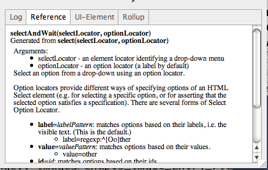

当参考标签中的快速参考没有价值时，查阅Selenium `参考`_ 文档是非常必要的。

.. _`参考`: http://release.openqa.org/selenium-core/1.0/reference.html
  
UI-Element and Rollup
~~~~~~~~~~~~~~~~~~~~~

这个两个窗格中的详细信息（涉及高级功能）可以在Selenium-IDE的帮助菜单中UI-Element文档中找到。
     
创建测试用例
-------------------
这里有三种开发测试用例的基本方法。
通常测试开发人员需要掌握所有三种技术。 

录制  
+++++++++

许多首次使用者都是以录制测试用例开始的，这些测试用例都来自他们与网站的交互。
当Selenium-IDE首次打开时，录制按钮默认是打开的。

.. note:: 
    通过一个可用的用户插件这个按钮可以设置成默认关闭。

.. TODO: mam-p: We need a link to this user extension.  It doesn't appear to be on the extensions page to which we've already referred readers. 

在录制过程中，Selenium-IDE将自动地根据你的操作把命令插入到你的测试用例中。
通常，这将包括：
  
* 点击一个链接 - *click* 或者 *clickAndWait* 命令
* 输入数值 - *type* 命令
* 从下拉列表框选择选项 - *select* 命令
* 点击复选框或单选按钮 - *click* 命令
  
这里有些“已知问题”需要注意：
  
* 为了能够录制 *type* 命令，需要点击页面的其他地方。
* 点击一个链接，通常会录制 *click* 命令。 
  你经常需要把它改成 *clickAndWait*  以确保测试用例暂停一会儿直到新页面加载完成。
  否则测试用例会在所以UI元素加载之前就继续运行命令。
  这样会导致意想不到的测试用例失败。
  
用右键菜单添加验证和断言
++++++++++++++++++++++++++++++++++++++++++++++++++++++
  
测试用例还需要检查网页的属性。
这就需要 *assert* 和 *verify* 命令。
但是在这里我们不会描述这些命令的具体使用情况；那将是 :ref:`"Selenese" Selenium命令集 <chapter04-cn-reference>` 章节的内容。
这里我们只是简单的描述如何把他们添加到测试用例中。

用Selenium-IDE录制的时候，在显示被测应用的浏览器页面的任何地方点击右键，
你将看到显示 *verify* 和 *assert* 命令的右键菜单。

.. TODO: add image here (it wasn't correctly uploaded in the GDocs version

首次使用Selenium，可能只有一条Selenium命令被列出。
然而随着IDE的使用，额外的命令很快被添加到这个菜单中。
你只需要在当前页面上选择UI元素，
Selenium-IDE会尝试预测命令以及命令的参数。
  
让我们来看看这是如何工作的。打开一个网页选择一段文本。段落或者标题都可以。
现在右键点击你选择的文本。
右键菜单会显示 *verifyTextPresent* 命令并且建议参数就是这段文本自身。
  
还请注意“显示所有命令”菜单选项。
它能显示更多的带建议参数的命令来测试当前选择的UI元素。
  
试试更多的UI元素。试着右键点击图片或者用户控件，例如按钮或者复选框。
你可能要用“显示所有命令”显示除 *verifyTextPresent* 以外的其他命令。
一旦选择了这些其他的选项，更常用的命令将会出现在初级的右键菜单中。
例如，对图片选择 *verifyElementPresent* ，当下次选择图片并右键点击的时候，
这条命令会在初级的右键菜单中可用。
  
再次说明，这些命令会在 :ref:`"Selenese" Selenium命令集 <chapter04-cn-reference>` 章节里详细解释。
但是现在，请随意使用IDE在测试用例里录制和选择命令然后运行。
通过IDE的简单实验，你能学会许多Selenium命令。
  
编辑  
+++++++

插入命令 
~~~~~~~~~~~~~~

表格视图
__________

在测试用例中选择一个插入命令的点。
右键点击并选择插入命令。
现在用命令编辑的文本域输入新命令和它的参数。

源码视图
___________

在测试用例中选择一个插入命令的点，输入HTML标签。
这些标签必须能够创建一个有3列的行，用来包含：命令，
第一参数（如果命令需要），第二参数（同样，如果有必要）。
确保切换回表格视图之前，保存你的测试。

  
插入注释 
~~~~~~~~~~~~~~

添加注释可以使你的测试更具可读性。
在运行测试用例的时候，这些注释会被忽略。

为了在你的测试中添加垂直方向上的空格（一个或更多的空行），你必须创建空注释。
空命令将导致运行时的错误。

表格视图
__________

在测试用例中选择一个插入注释的点。
右键点击并选择插入注释。
现在用命令域输入注释。你的注释将显示成紫色字体。

源码视图
___________

在测试用例中选择一个插入注释的点。
添加HTML风格的注释，例如， *<!-- 你的注释在这里 -->* 。
  
编辑命令或者注释
~~~~~~~~~~~~~~~~~~~~~~~~~

表格视图
__________

只需选择需要修改的行并用命令、目标和数值域修改它。

源码视图
___________

因为源码视图提供了一种相当于所见即所得的编辑器，
所以只需修改你想修改的行——命令、参数或者注释。

打开和保存测试用例
++++++++++++++++++++++++++++++

作为菜单命令的文件=>打开、保存和另存为在大多数其他的程序中都有相似的打开和保存文件功能。
当你打开一个已存在的测试用例时，Selenium-IDE就在测试用例窗格显示它的命令。

通过文件菜单，测试套件文件也可以被打开和保存。
然而这些操作在菜单底部有自己的菜单项；
打开、保存和另存为只针对文件。  
  
.. note:: 
    写到目前为止，这里有一个缺陷。
    有时当IDE第一次打开，然后选择文件=>打开，但是什么都没有发生。
    如果你遇到这种情况，就关掉IDE然后再打开（你不必关闭浏览器自身）。
    这样可以解决以上的问题。
  
运行测试用例
------------------

IDE有许多种运行测试用例的选项。你可以一次运行整个测试用例，
停止和启动它，一次执行一行，执行你正在开发的命令，
你还可以批处理运行整个测试套件。
用IDE执行测试用例是非常灵活的。
  
运行测试用例
    点击运行按钮运行当前显示的测试用例。
  
运行测试套件
    点击运行所有按钮运行当前加载的测试套件的所有测试用例。
  
停止和启动
    暂停按钮可以用于停止正在运行的测试用例。
    然后这个按钮的图标会变成恢复按钮。
    点击恢复按钮可以继续运行。
  
在中间停止
    你可以在测试用例中设置一个断点以使得测试用例停在一条特定的命令上。
    这对于调试测试用例是非常有用的。
    要设置断点，选择一条命令，点击右键，从右键菜单中选择切换断点。
  
从中间开始
    你可以告诉IDE从测试用例中间的一条特定命令开始运行。这也是用于调试。
    要设置一个起点，选择一条命令，点击右键，从右键菜单中选择设置/清除断点。
  
运行任意一条命令
    双击任何一条命令可以运行它。这对于编写单条命令是很有用的。
    当你不能确定命令是否正确时，它可以立即测试你正创建的命令。
    你可以双击它，看它是否运行正确。它还可以在右键菜单里执行。
  
用基准URL在不同域中运行测试用例
-----------------------------------------------------
.. TODO: mam-p: Figure out how to display the many URLs in the section below without generating links for each one.  (They're just examples, i.e., not real!)

在Selenium-IDE顶部的 *基准URL* 域对允许测试用例跨域运行非常有用。
假设一个站点命名为\http://news.portal.com ，它有一个内部的beta站点命名为
\http://beta.news.portal.com 。
任何测试这些站点并以 *open* 命令开头的测试用例应该指定一个 *相对URL* 作为
*open* 命令的参数，而不是 *绝对URL* （绝对URL以协议开头，例如http:或者https:）。
Selenium-IDE将会以在 *基准URL* 的基础上追加 *open* 命令参数的方式创建绝对URL。
例如，下面的测试用例将会测试\http://news.portal.com/about.html：

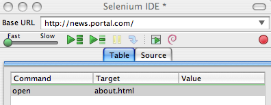

修改过基准URL的相同测试用例将运行在
http://beta.news.portal.com/about.html:

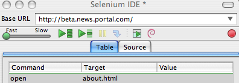
 
调试
---------
调试意味着发现并修改测试用例中的错误。这是测试用例开发的正常部分。
  
我们在这里不教授调试，因为大多数Selenium-IDE的使用者已经有了基础的调试经验。
如果这对你来说是新的，我们建议你问问在你的组织中的开发人员。

.. TODO: mam-p: The two sections below have a great deal of overlap with "Running Test Cases" above.

断点和起点
+++++++++++++++++++++++++++

Sel-IDE支持断点设置，从测试用例的任何一点都可以启动和停止测试用例的运行。
你可以在测试用例中间运行特定的命令，并且检查测试用例在那一点是如何工作的。
做到这一点，请在你要检查的命令前设置断点。
  
要设置断点，选择一个命令，单击右键，并从右键菜单中选择 *切换断点* 。
然后单击运行按钮执行从起始到断点处的测试用例。

有时候从测试用例的中间某处执行到结尾，或者从起点运行到断点是非常有用的。
例如，假设你的测试用例先登录网站，然后进行了一系列测试并且正调试其中的一个测试。
然而，您只需要登录一次，但是你需要再运行你的测试的时候就像你开发他们的时候一样。
你可以登录一次，然后从登录部分后面已经设置好起点的地方运行你的测试用例。
这将阻止你每次再次运行测试用例的时候不必手动注销。
  
要设置起点，选择一个命令，单击右键，并从右键菜单中选择 *设置/清除起点* 。
然后点击运行按钮从起点处执行测试用例。
  
单步调试测试用例
+++++++++++++++++++++++++++

一次执行一条测试用例命令（单步执行它），依照下面的步骤：

1. 用工具栏的运行按钮启动测试用例的运行。  

.. image:: ../images/chapt3_img08_Run.png
   :align: center

2. 立即用暂停按钮暂停正在执行的测试用例。

3. 反复选择步骤按钮。

.. image:: ../images/chapt3_img11_Step.png
   :align: center

Find Button 
+++++++++++

The Find button is used to see which UI element on the currently displayed 
webpage (in the browser) is used in the currently selected Selenium command.  
This is useful when building a locator for a command's first parameter (see the
section on :ref:`locators <locators-section>` in the Selenium Commands chapter). It can be used with any
command that must identify a UI element on a webpage, i.e. *click*, 
*clickAndWait*, *type*, and certain *assert* and *verify* commands, 
among others. 
  
From Table view, select any command that has a locator parameter.
Click the Find button.  
Now look on the webpage displayed in the Firefox browser.  
There should be a bright green rectangle enclosing the element specified
by the locator parameter. 

Page Source for Debugging 
+++++++++++++++++++++++++

Often, when debugging a test case, you simply must look at the page source (the 
HTML for the webpage you're trying to test) to determine a problem.  Firefox 
makes this easy.  Simply, right-click the webpage and select Page Source.  
The HTML opens in a separate window.  Use its Search feature (Edit=>Find)
to search for a keyword to find the HTML for the UI element you're trying 
to test. 

Alternatively, select just that portion of the webpage for which you want to
see the source.  Then right-click the webpage and select View Selection
Source.  In this case, the separate HTML window will contain just a small
amount of source, with highlighting on the portion representing your
selection.

Locator Assistance
++++++++++++++++++

Whenever Selenium-IDE records a locator-type argument, it stores
additional information which allows the user to view other possible 
locator-type arguments that could be used instead.  This feature can be
very useful for learning more about locators, and is often needed to help
one build a different type of locator than the type that was recorded.  

This locator assistance is presented on the Selenium-IDE window as a drop-down
list accessible at the right end of the Target field 
(only when the Target field contains a recorded locator-type argument).  
Below is a snapshot showing the
contents of this drop-down for one command.  Note that the first column of
the drop-down provides alternative locators, whereas the second column
indicates the type of each alternative.

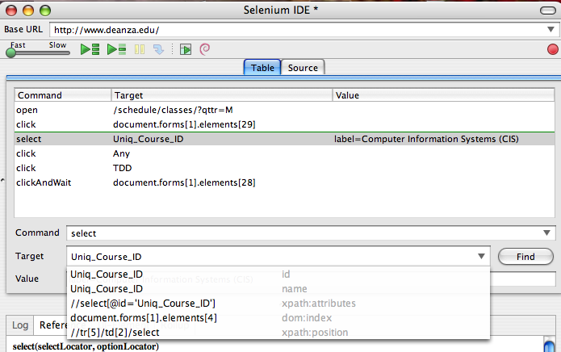

Writing a Test Suite 
--------------------
A test suite is a collection of test cases which is displayed in the leftmost
pane in the IDE.  
The test suite pane can be manually opened or closed via selecting a small dot
halfway down the right edge of the pane (which is the left edge of the 
entire Selenium-IDE window if the pane is closed).

The test suite pane will be automatically opened when an existing test suite 
is opened *or* when the user selects the New Test Case item from the
File menu.  In the latter case, the new test case will appear immediately
below the previous test case.

Selenium-IDE does not yet support loading pre-existing test cases into 
a test suite.  Users who want to create or modify a test suite by adding
pre-existing test cases must manually edit a test suite file.

A test suite file is an HTML file containing a one-column table.  Each
cell of each row in the <tbody> section contains a link to a test case.
The example below is of a test suite containing four test cases:

.. code-block:: html

	<html>
        <head>
            <meta http-equiv="Content-Type" content="text/html; charset=UTF-8">
            <title>Sample Selenium Test Suite</title>
        </head>
        <body>
            <table cellpadding="1" cellspacing="1" border="1">
                <thead>
                    <tr><td>Test Cases for De Anza A-Z Directory Links</td></tr>
                </thead>
            <tbody>
                <tr><td><a href="./a.html">A Links</a></td></tr>
                <tr><td><a href="./b.html">B Links</a></td></tr>
                <tr><td><a href="./c.html">C Links</a></td></tr>
                <tr><td><a href="./d.html">D Links</a></td></tr>
            </tbody>
            </table>
        </body>
	</html>
	
.. note::
   Test case files should not have to be co-located with the test suite file
   that invokes them.  And on Mac OS and Linux systems, that is indeed the
   case.  However, at the time of this writing, a bug prevents Windows users
   from being able to place the test cases elsewhere than with the test suite
   that invokes them.

.. do some testing here of test suites鈥攄o they save correctly?
   I've seen errors in the past. 
  
User Extensions 
---------------
User extensions are JavaScript files that allow one to create his or her own 
customizations and features to add additional functionality.  Often this is in 
the form of customized commands although this extensibility is not limited to 
additional commands.  
  
There are a number of useful extensions_ created by users.

.. _extensions: http://wiki.openqa.org/display/SEL/Contributed+User-Extensions

Perhaps the most popular of all Selenium-IDE extensions
is one which provides flow control in the form of while loops and primitive
conditionals.  This extension is the goto_sel_ide.js_.  For an example
of how to use the functionality provided by this extension, look at the
page_ created by its author.

.. _goto_sel_ide.js: http://wiki.openqa.org/download/attachments/379/goto_sel_ide.js
.. _page: http://51elliot.blogspot.com/2008/02/selenium-ide-goto.html

To install this extension, put the pathname to its location on your
computer in the **Selenium Core extensions** field of Selenium-IDE's
Options=>Options=>General tab.

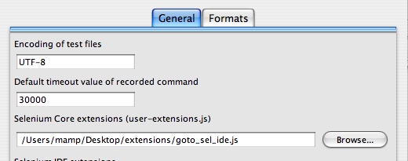

After selecting the **OK** button, you must close and reopen Selenium-IDE
in order for the extensions file to be read.  Any change you make to an
extension will also require you to close and reopen Selenium-IDE.

Information on writing your own extensions can be found near the
bottom of the Selenium Reference_ document.

.. _Reference: http://release.openqa.org/selenium-core/1.0/reference.html

.. TODO:  mam-p: need info on how to install user extensions, especially on the diff
   between "Selenium Core Extensions" and "Selenium IDE" extensions on the
   Options=>Options=>General page.

Format 
------

Format, under the Options menu, allows you to select a language for saving 
and displaying the test case.  The default is HTML.
  
If you will be using Selenium-RC to run your test cases, this feature is used 
to translate your test case into a programming language.  Select the 
language, i.e. Java, PHP, you will be using with Selenium-RC for developing 
your test programs.  Then simply save the test case using File=>Save.  Your 
test case will be translated into a series of functions in the language you 
choose.  Essentially, program code supporting your test is generated for you 
by Selenium-IDE. 
  
Also, note that if the generated code does not suit your needs, you can alter 
it by editing a configuration file which defines the generation process.  
Each supported language has configuration settings which are editable.  This 
is under the Options=>Options=>Format tab. 
  
.. TODO: Add the steps here to change the format. 
  
.. note::
   At the time of this writing, this feature is not yet supported by the Selenium 
   developers.  However the author has altered the C# format in a limited 
   manner and it has worked well. 
  
Executing Selenium-IDE Tests on Different Browsers
--------------------------------------------------
While Selenium-IDE can only run tests against Firefox, tests
developed with Selenium-IDE can be run against other browsers, using a
simple command-line interface that invokes the Selenium-RC server.  This topic
is covered in the :ref:`Run Selenese tests <html-suite>` section on Selenium-RC
chapter. The *-htmlSuite* command-line option is the particular feature of interest.

Troubleshooting
---------------
Below is a list of image/explanation pairs which describe frequent
sources of problems with Selenium-IDE:

|startup|
    This problem occurs occasionally when Selenium IDE is first brought up.  The solution is to close and reopen Selenium IDE.  The bug has been filed as `SIDE-230`_.

.. _SIDE-230: http://jira.openqa.org/browse/SIDE-230

------------------

|open|
    You've used **File=>Open** to try to open a test suite file. Use **File=>Open Test Suite** instead.

------------------

|timing|
    This type of **error** may indicate a timing problem, i.e., the element 
    specified by a locator in your command wasn't fully loaded when the command 
    was executed.  Try putting a **pause 5000** before the command to determine 
    whether the problem is indeed related to timing.  If so, investigate using an 
    appropriate **waitFor\*** or **\*AndWait** command immediately before the 
    failing command.

------------------

|param|
    Whenever your attempt to use variable substitution fails as is the
    case for the **open** command above, it indicates
    that you haven't actually created the variable whose value you're
    trying to access.  This is 
    sometimes due to putting the variable in the **Value** field when it 
    should be in the **Target** field or vice versa.  In the example above,
    the two parameters for the **store** command have been erroneously
    placed in the reverse order of what is required.
    For any Selenese command, the first required parameter must go 
    in the **Target** field, and the second required parameter (if one exists) 
    must go in the **Value** field.  

----------

|ts|
    One of the test cases in your test suite cannot be found.  Make sure 
    that the test case is indeed located where the test suite indicates 
    it is located.  Also, 
    make sure that your actual test case files have the .html extension both 
    in their filenames, and in the test suite file where they are referenced.

----------

|space|
    Selenium-IDE is very *space-sensitive*!  An extra space before or after 
    a command will cause it to be unrecognizable.

----------

|extension|
    Your extension file's contents have not been read by Selenium-IDE.  Be 
    sure you have specified the proper pathname to the extensions file via 
    **Options=>Options=>General** in the **Selenium Core extensions** field.
    Also, Selenium-IDE must be restarted after any change to either an
    extensions file *or* to the contents of the **Selenium Core extensions**
    field.

----------

|collapsed|
    This type of error message makes it appear that Selenium-IDE has generated
    a failure where there is none.  However, Selenium-IDE is correct that
    the actual value does not match the value specified in such test cases.
    The problem is that the log file error messages collapse a series of
    two or more spaces into a single space, which is confusing.  In the 
    example above, note that the parameter for **verifyTitle** has two 
    spaces between the words "System" and "Division."  The page's actual 
    title has only one space between these words.  Thus, Selenium-IDE is 
    correct to generate an error.

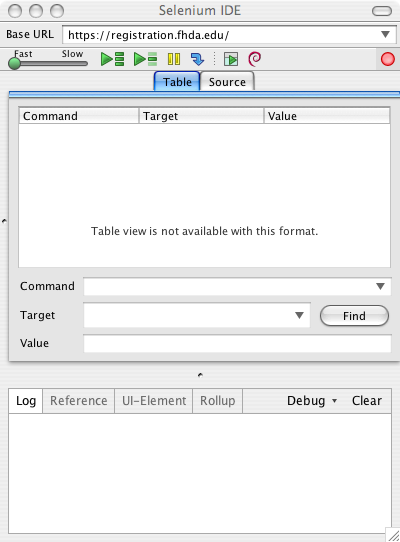
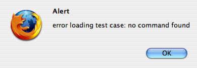
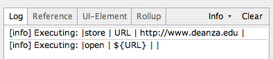
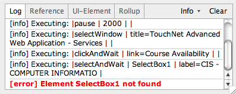
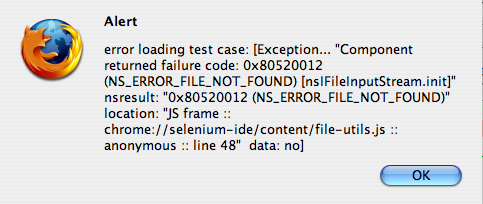
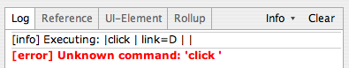
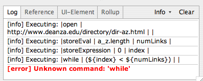
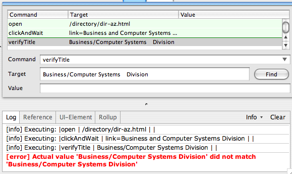
