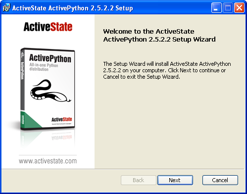
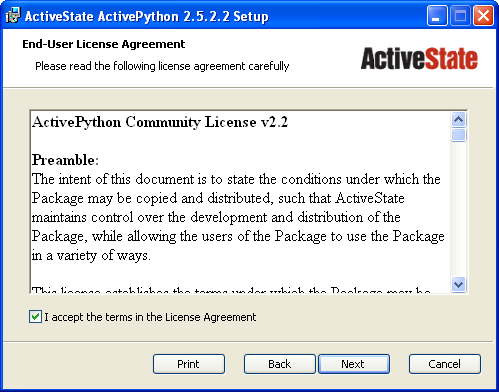
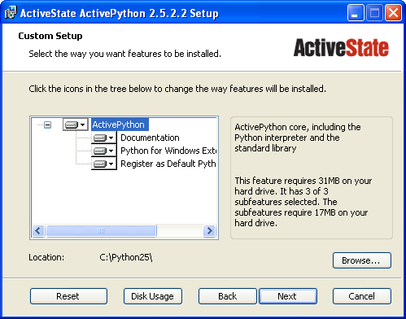
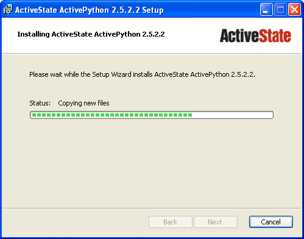
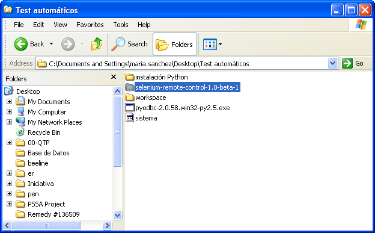
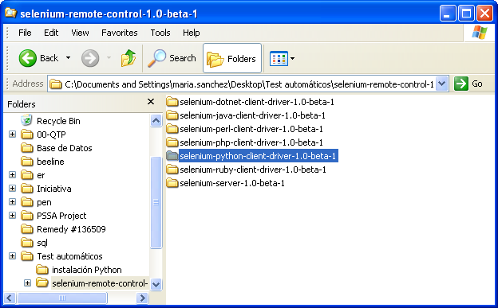
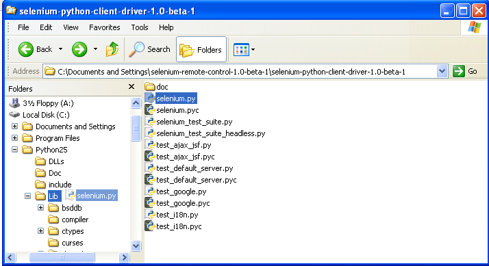

Selenium RC
===========

.. contents::

When to Use Selenium RC?
------------------------

Selenium RC is the response for tests that need a little more that just simple 
browser actions and a linear excecution. Selenium RC allows the users to use 
the full power of programming languages, allowing the users to create tests 
that can read and write external files, make queries to a Data Base, send 
emails with the tests report, practically anything that a user can do with 
a common application.

You can see some examples of this in the `Sample Test Scripts`_ section
, where we will explain how to develop complex tests and leverage the power of 
a real programming language in them.

Basically, you will need to use Selenium-RC whenever your test requires logic
not supported by running a script from the Sel-IDE.  What sort of logic could 
this be?  For example, the Selenium-IDE does not directly support

* condition statements 
* iteration 
* logging and reporting of test results. 
* error handling, particularly of unexpected errors. 
* database testing 
* test case grouping 
* rerun the failed tests 
* test case dependency 
* capture screen shot on test failure 
  
Though few of these are not supported by selenium inherently but can be achieved
by using language specific library. These would be explained in details in 
the `Sample Test Scripts`_ section. 
  
It may be possible to add this functionality by adding a custom built user 
extension to Sel-IDE but most prefer to use Sel-RC to gain the full flexibility
of a programming language.

Architecture Diagram
--------------------

.. Paul: I initiated a couple of forum posts that can shed some light here.  
   Some of the content in those posts can server as descriptive info for us.
   This comment is a reminder for me to get that info off OpenQA.

Selenium RC comes in two parts:

.. Paul: hope you don't mind, I changed this to bullets from your numbers to 
   make it agree with the earlier sections 
   
* A server which automatically launches and kills browsers, and acts as a HTTP
  proxy for web requests from them. 
* Client libraries for your favorite programming language. 

The RC server bundles Selenium Core, and automatically injects it into the 
browser withing the Application Under Test.

.. Paul: So that leads to questions....Does this mean when the server starts up,
   it takes the Sel-Core javascript, inserts it into a spoofed URL, and opens 
   the browser with that URL?  Where is the Sel-core code injected?  Into the 
   AUT?  It can't because the AUT is on a server somewhere.  So the Sel-Core is
   injected straight into the browser and then the Sel-Core-Injected-Browser 
   communicates with the AUT.  Is this correct?
   

Here is a simplified architectural representation.... 

.. image:: images/chapt5_img01_Architecture_Diagram_Simple.png

.. Paul: This diagram always leads me to more questions than answers.  I'll 
   admit though that it looks really nice.  I think what's missing is 
   a) where is the AUT?   
      Tarun: AUT can be conceived running in browser. 
   b) Why is 'linux, Windows, Mac" listed just at the top, I don't think the OS
   is relevant to the diagram but the AUT really is. 
      Tarun: I guess it is to emphasize that tests could be run on multiple 
	  platforms
   c)  I'd like to see some diagrams that include the messages going between 
   the components.  That will add a lot of understanding for people.  Is that 
   something we can do? If we don't have the info I'm sure we can get it from 
   the other gurus (notice I said 'other gurus' ;-) )
      Santi: I think we will have to re-do this diagram, I have in mind 
	  something that has the same content and the next diagram but with some 
	  corrections (the AUT passes through the proxy also) and with the pretty 
	  logos

.. Paul: Um, I just wrote that comment, and then saw your 2nd diagram.  Looks 
   like the 2nd diagram may address some of my questions.  I'll have to 
   reconcile my questions against that one, also.

How Selenium Remote Control works 
----------------------------------

The Selenium Server communicates directly with the browser using AJAX 
(XmlHttpRequest). You can send commands directly to the Server using simple 
HTTP GET/POST requests; that means that you can use any programming language 
that can make HTTP requests to automate Selenium tests on the browser. To 
further ease this process, we provide wrapper objects for a number of 
mainstream programming languages (.NET, Erlang, Java, Javascript, Perl, PHP, 
Python and Ruby).  

.. Paul: Let's also emphasize that these 'wrapper objects'  are  APIs 
   supporting the Selenium commands and are provided as libraries to that 
   programming language
   
Finally, the Selenium Server acts as a client-configured HTTP proxy, to stand 
in between the browser and your website. This allows a Selenium-enabled browser
to run JavaScript on arbitrary websites.

.. Paul: I don't quite understand this.  What exactly is a 'proxy'?  and what 
   does 'client-configured' mean?  which client? I'm assuming the test 
   application, but some may think of the browser as a 'client'.  Can we expand 
   this a bit with some simplified terminology? I'm thinking especially for the
   new users, some who may not have a solid a technical background. 
	  Santi: The proxy is a third person in the middle that passes the ball 
	  between the two parts. In this case will act as a "web server" that 
	  delivers the AUT to the browser, by doing this, the server hides the original
	  URL and uses it's own (this allows us to put selenium Core in the same 
	  location as the AUT without actually putting it).
   Paul: What is "client-configured"? 
      Santi: The client browser (firefox, IE, etc) is launched with a 
	  configuration profile that has set localhost:4444 as the http proxy, this
	  is why any http request that the browser does will pass through selenium
	  server and the response will come from this server and not from the real
	  server.

Here is an architectural diagram. 

.. Santi: Notice: in step 5, the AUT should pass through the HTTPProxy to go to 
   the Browser....
   
.. image:: images/chapt5_img02_Architecture_Diagram.png

As a test suite starts in your favorite language, the following happens:

1. The client/driver establishes a connection with the selenium-server.
2. Selenium-Server launches a browser (or reuses an old one) with a URL that 
   will load Selenium core web page.
   
.. Paul: Where does that URL come from? 
   Tarun: URL is one of the four parameters which is specified while creating 
   the Defult Selenium object. Once the DefaultSelenium object is created then 
   open method used to launch web application, here open method takes url as 
   parameter and lunches the browser. Does this explanation help?

3. Selenium-Core gets the first instruction from the client/driver (via the 
   HTTP Proxy built into the Selenium RC Server).

.. Paul: Is the 'client/driver' the test program?
   Tarun: No it's the language in which selenium tests are written
   
4. Selenim-Core acts on that first instruction, typically opening a page of the
   AUT. 
5. The web server is asked for that page, and it renders in the frame/window 
   reserved for it. 

.. Paul: In spite of my many questions, I still think this is a really good 
   start!
   Santi: I will create a new diagram that will simplify this and add some 
   eyecandy.

Installation
------------

.. Here we will put the process for installing selenium RC and the different 
   client libraries, maybe we should also cover some IDEs. We should talk a 
   little more about this part...

.. Paul: Could one of you guys please put in a brief description of what is 
   IntelliJ?  I'm not familiar with it and I'm sure some other readers will be 
   in the same boat. Please include a short sentence that mentions who uses it 
   and/or why it is used--just to add some context. 
   Tarun: I would do this.
   Santi: We should create a short generic description that describes what is 
   and IDE that will be enough to understand what IntelliJ, Eclipse or any of
   them mean.

Java installation
~~~~~~~~~~~~~~~~~~

In General configuration of Selenium RC with any java IDE would have following 
steps:

* Download Selenium RC from the `downloads page`_ 
* Start any java IDE
* Create new project
* Add to your project classpath selenium-java-client-driver.jar 
* Record your test to from Selenium IDE and translate it to java code (Selenium
  IDE has automation translation feature)
* Run selenium server from console (You need initialized java environment 
  variable to do this) like::

	java -jar selenium-server -proxyInjectionMode. 

.. Note:: Server can be started from java as well.

* Run your test in the IDE

These points have been delineated below with reference to Eclipse and IntelliJ: 

Configuring Selenium RC with Eclipse
++++++++++++++++++++++++++++++++++++

**Eclipse** is a multi-language software development platform comprising an IDE 
and a plug-in system to extend it. It is written primarily in Java and is used 
to develop applications in this language and, by means of the various plug-ins, 
in other languages as well — C/C++, Cobol, Python, Perl, PHP and more.

This document describes configuration of Selenium RC with Eclipse - 
Version: 3.3.0. (Europa Release). It should not be too different for higher 
versions of Eclipse 
  
* Launch Eclipse.  
* Select File > New > Other. 

.. image:: images/chapt5_img03_Launch_Eclipse.png

* Java > Java Project > Next 

.. image:: images/chapt5_img04_Create_Java_Project.png

* Provide Name to your project, Select JDK in ‘Use a project Specific JRE option (JDK 1.5 selected in this example) > click Next 
  
.. image:: images/chapt5_img05_Create_Java_Project.png

* Keep 'JAVA Settings' intact in next window. Project specific libraries can be added here. (This described in detail in later part of document.)   

.. image:: images/chapt5_img06_Create_Java_Project.png 

* Click Finish > Click on Yes in Open Associated Perspective pop up window. 

.. image:: images/chapt5_img07_Create_Java_Project.png 

This would create Project Google in Package Explorer/Navigator pane.

.. image:: images/chapt5_img08_Package_Explorer.png 

* Right click on src folder and click on New > Folder 

.. image:: images/chapt5_img09_Create_Com_Package.png 

Name this folder as com and click on Finish button.

* This should get com package insider src folder. 

.. image:: images/chapt5_img10_Create_Com_Package.png 

* Following the same steps create *core* folder inside *com*

.. image:: images/chapt5_img11_Create_Core_Package.png 
  
SelTestCase class can be kept inside *core* package. 

Create one more package inside *src* folder named *testscripts*. This is a 
place holder for test scripts. 
  
*Please notice this is about the organization of project and it entirely 
depends on individual's choice /  organization's standards. Test scripts 
package can further be segregated depending upon the project requirements.*

.. image:: images/chapt5_img12_Create_Test_Script_Package.png 

* Create a folder called lib inside project Google. Right click on Project name
  > New > Folder. This is a place holder for jar files to project (i.e. Selenium 
  client driver, selenium server etc) 

.. image:: images/chapt5_img13_Create_Library_Package.png
  
This would create lib folder in Project directory. 

.. image:: images/chapt5_img14_Create_Library_Package.png

* Right click on *lib* folder > Build Path > Configure build Path 

.. image:: images/chapt5_img15_Configure_Build_Path.png

* Under Library tab click on Add External Jars to navigate to directory where 
  jar files are saved. Select the jar files which are to be added and click on 
  Open button. 

.. image:: images/chapt5_img16_Configure_Build_Path.png

.. Note: Here in Selenium Server, Selenium Java Client driver and TestNG jar 
   files have been added. TestNG is a testing framework which can be used to
   build selenium tests. As an alternative to TestNG, JUnit jar can be added to
   write selenium tests. 

After having added jar files click on OK button. 

.. image:: images/chapt5_img17_Configure_Build_Path.png
  
Added libraries would appear in Package Explorer as following:
  
.. image:: images/chapt5_img18_Configure_Build_Path.png

Configuring Selenium RC with Intellij
+++++++++++++++++++++++++++++++++++++

**IntelliJ IDEA** is a commercial Java IDE by the company JetBrains. Intellij 
provides a set of integrated refactoring tools that allow programmers to 
quickly redesign their code. IntelliJ IDEA provides close integration with 
popular open source development tools such as CVS, Subversion, Apache Ant and 
JUnit.

.. <Documentation is in progress> 

Python installation 
~~~~~~~~~~~~~~~~~~~~

The following steps describe the basic installation procedure. After following 
this, the user can start using the desired IDE, (even write tests in a text 
processor and run them from command line!) without any extra work (at least 
from the selenium's part).

* Installing Python.
  This will cover python installation on Windows only, as in most of linux 
  distributions, python is already pre-installed by default. 

.. Santi: I will investigate and post the mac install part

	1. Download Active python’s installer from ActiveState’s official site: 
	http://activestate.com/Products/activepython/index.mhtml 
	2. Run the installer downloaded (ActivePython-x.x.x.x-win32-x86.msi)

	
* Installing the Selenium driver client for python 

	1. Download the last version of Selenium Remote Control from the 
	   `downloads page`_
	2. Extract the content of the downloaded zip file 
	3. Copy the module with the Selenium’s driver for Python (selenium.py) in 
	   the folder *C:/Python25/Lib* (this will allow you to import it directly in
	   any script you write).
	   
	   You will find the module in the extracted folder, it’s located inside 
	   *selenium-python-driver-client* .

.. _`downloads page`: http://seleniumhq.org/download/

  
Congratulations, you’re done! Now any python script that you create can import 
selenium and start interacting with the browsers. 
  
Sample Test Scripts
-------------------

Sample Sel-RC Test Application

* Starting the Browser 
* Running Commands 
* Retrieving and Reporting Results

.. Tarun: I suggest going one step ahead and creating sample projects in 
   different languages like the one available here - 
   http://code.google.com/p/aost/downloads/list , I know this is going to be 
   very very time consuming and we even don't have any sample website which we 
   could use!!! May be we could use selenium web site it self for our sample 
   tests
   Paul: I'd say everyone should contribute where they are most motivated and 
   excited to contribute.  So if someone wants to do this then exellent 
   contribution!  I don't envy the time commitment here though! As long as a 
   couple of us at least are doing the primary document so we can still get 
   that out in a timely manner.  Perhaps we can set up a place on SelHQ where 
   different users can contribute sample projects? My vote for now would be to 
   hang onto this idea, but focus on the primary sections for now and let's see
   how things shape up.

Server Command Line options
---------------------------

.. Paul: Can we put some info in here about how/when a user would use some of 
   these features?  Some, like the port, should be obvious.  But let's see if
   we can think of some examples.  
   Like.....Why would I ever want -singleWindow?  This is a great section 
   though.  I didn't even know about this until about 2 weeks ago.

Usage::
 
	java -jar selenium-server.jar [-interactive] [options] 

Options: 
-port <nnnn>
    The port number the selenium server should use (default 4444) 
-timeout <nnnn>
    An integer number of seconds before we should give up 
-interactive
    Puts you into interactive mode. See the tutorial for more details.
-singleWindow
    Puts you into a mode where the test web site executes in a frame. This mode
	should only be selected if the application under test does not use frames. 
-profilesLocation
    Specifies the directory that holds the profiles that java clients can use 
	to start up selenium. Currently supported for Firefox only.
	
.. Paul: Is 'java client' the right word here?  It's the browser that uses the 
   profile right?

.. Paul: Is this different from -firefoxProfileTemplate?

-forcedBrowserMode <browser>
    Sets the browser mode (e.g. "*iexplore" for all sessions, no matter what is 
	passed to getNewBrowserSession 
-forcedBrowserModeRestOfLine <browser>
    Sets the browser mode to all the remaining tokens on the line (e.g. 
	"*custom /some/random/place/iexplore.exe") for all sessions, no matter what
	is passed to getNewBrowserSession 
-userExtensions <file>
    Indicates a JavaScript file that will be loaded into selenium 
-browserSessionReuse
    Stops re-initialization and spawning of the browser between tests 
-avoidProxy
    By default, we proxy every browser request; set this flag to make the 
	browser use our proxy only for URLs containing '/selenium-server' 
-firefoxProfileTemplate <dir>
    Normally, we generate a fresh empty Firefox profile every time we launch. 
	You can specify a directory to make us copy your profile directory instead. 
-debug
    Puts you into debug mode, with more trace information and diagnostics 
-browserSideLog
    Enables logging on the browser side; logging messages will be transmitted 
	to the server. This can affect performance. 
-ensureCleanSession
    If the browser does not have user profiles, make sure every new session has
	no artifacts from previous sessions. For example, enabling this option will
	cause all user cookies to be archived before launching IE, and restored 
	after IE is closed. 
-trustAllSSLCertificates
    Forces the Selenium proxy to trust all SSL certificates. This doesn't work 
	in browsers that don't use the Selenium proxy. 
-log <LogFileName>
    Writes lots of debug information out to a log file 
-htmlSuite <browser> <startURL> <suiteFile> <resultFile>
    Run a single HTML Selenese (Selenium Core) suite and then exit immediately, 
	using the specified browser (e.g. "*firefox") on the specified URL 
	(e.g. "http://www.google.com"). You need to specify the absolute path to 
	the HTML test suite as well as the path to the HTML results file we'll 
	generate. 
-proxyInjectionMode
    Puts you into proxy injection mode, a mode where the selenium server acts
	as a proxy server for all content going to the test application. Under 
	this mode, multiple domains can be visited, and the following additional 
	flags are supported:
	
.. Paul: We'll probably need a whole section explaining proxyInjectionMode that
   includes when, and why, someone might use it.
  
	-dontInjectRegex <regex>
	    An optional regular expression that proxy injection mode can use to 
		know when to bypss injection 
	-userJsInjection <file>
	    Specifies a JavaScript file which will then be injected into all pages 
	-userContentTransformation <regex> <replacement>
        A regular expression which is matched against all test HTML content; 
		the second is a string which will replace matches. These flags can be 
		used any number of times. A simple example of how this could be 
		useful: if you add "-userContentTransformation https http" then all 
		"https" strings in the HTML of the test application will be changed to 
		be "http". 

We also support two Java system properties: -Dhttp.proxyHost and -Dhttp.proxyPort.
Selenium RC normally overrides your proxy server configuration, using the 
Selenium Server as a proxy. Use these options if you need to use your own proxy 
together with the Selenium Server proxy. Use the proxy settings like like this:: 

	java -Dhttp.proxyHost=myproxy.com -Dhttp.proxyPort=1234 -jar selenium-server.jar 

If your HTTP proxy requires authentication, you will also need to set -Dhttp.proxyUser
and -Dhttp.proxyPassword, in addition to http.proxyHost and http.proxyPort::

	java -Dhttp.proxyHost=myproxy.com -Dhttp.proxyPort=1234 -Dhttp.proxyUser=joe 
	-Dhttp.proxyPassword=example -jar selenium-server.jar

Howto correctly use your Verify commands in Selenium RC 
I'll put some info from http://clearspace.openqa.org/message/56908#56908 (we should write an example for all the languages...) -Santiago Suarez Ordoñez 2/18/09 10:59 AM

Paul's part

Sel-IDE Generated Code

Starting the Browser 
Specify the Host and Port 
  
localhost:4444 
  
The Sel-RC Program's Main() 

Handling HTTPS and Security Popups 
  
Many applications will switch from using HTTP to HTTPS when they need to send encrypted information such as passwords or credit card information.  This is common with many of today’s web applications.  Selenium-RC supports this.  
  
Also, the browser will need a security certificate to Selenium.  Otherwise, when the Selenium code is inserted between the browser and the application under test, the browser will recognize this as a security violation.  It will assume some other site is masquerading as your application.  When this occurs the browser displays security popups, and these popups cannot be closed using Selenium-RC. 
  
When dealing with HTTPS you must use a run mode that supports this and handles the security certificate for you.  You specify the run mode when you test program initialized Selenium. 
  
            copy my C# code example here. 
  
In Selenium RC 1.0 beta 2 and later use *firefox or *iexplore for the run mode.  In earlier versions, including Sel-RC 1.0 beta 1, use *chrome or *iehta, for the run mode.  Using these run modes, you will not need to install any special security certificates to prevent your browser’s security warning popups. 
  
In Selenium 1.0 beta 2 and later, the run modes *firefox or *iexplore are recommended.  There are additional run modes of *iexploreproxy and *firefoxproxy.  These are provided only for backwards compatibility and should not be used unless required by legacy test programs.  Their use will present limitations with security certificate handling and with the running of multiple windows if your application opens additional browser windows.  
  
In earlier versions of Sel-RC, *chrome or *iehta were the run modes that supported HTTPS and the handling of security popups.  These were ‘experimental modes’ in those versions but as of Sel-RC 1.0 beta 2, these modes have now become stable, and the *firefox and *iexplore run modes now translate into the *chrome and *iehta modes. 
  
Security Certificates Explained  
Normally, your browser will trust the application you are testing, most likely by installing a security certificate which you already own.  You can check this in your browser’s options or internet properties (if you don’t know your AUT’s security certificate as you system administrator or lead developer).  When Selenium loads your browser it injects code to intercept messages between the browser and the server.  The browser now thinks something is trying to look like your application, but really is not--a significant security risk.  So, it responds by alerting you with popup messages.   
  
Please, can someone verify that I explained certificates correctly?—this is an area I’m not certain I understand well yet. 
  
To get around this, Selenium-RC, (again when using a run mode that support this) will install its own security certificate, temporarily, onto your client machine in a place where the browser can access it.  This tricks the browser into thinking it’s accessing a different site from your application under test and effectively suppresses the security popups. 
  
Another method that has been used with earlier versions of Selenium is to install the Cybervillians security certificate provided with you selenium installation.  Most users should no longer need to do this, however, if you are running Sel-RC in proxy injection mode, you may need to explicitly install this security certificate to avoid the security popups. 
    
Multi-Window Mode  
Many applications will open additional, secondary windows.  Selenium RC 1.0 beta 2 and later support this automatically with the *firefox and *iexplore run modes.  
Older versions of Selenium however did not handle this unless you explicitly told the server to run in multiwindow mode. For handling multiple windows, Selenium 0.9.2 required the Server to be started with the following option. 
  
  -multiwindow 
  
In Selenium RC 1.0 beta 2 and later if you want to require your testing to run in a single frame you can explicitly state this to the Selenium Server using the option 
 
  -singlewindow 
  
  I think this multiwindow explanation is not correct paul, Selenium works in multiwindow just to better support applications that use frames -Santiago Suarez Ordoñez 2/15/09 12:16 PM  
Using the Browser While Selenium is Running 
You may want to use your browser at the same time that Selenium is also using it.  Perhaps you want to run some manual tests while Selenium is running your automated tests and you wish to do this on the same machine.  Or perhaps you just want to use your Facebook account but Selenium is running in the background.  This isn’t a problem. 
  
With Internet Explorer, you can simply start another browser instance and run it in parallel to the IE instance used by Sel-RC.  With Firefox, you can do this also, but you must specify a separate profile. 
  
Specifying a Separate Firefox Profile 
Firefox will not run two instances simultaneously unless you specify a separate profile for each instance.  Later versions of Sel-RC run in a separate profile automatically, however, if you are using an older version of Selenium, you may need to explicitly specify a separate profile.  
  
Open the Windows "Start" menu, select "Run",then type and enter one of the following: 

   firefox.exe -profilemanager 
   firefox.exe -P 

Create a new profile using the dialog. 
When you run the Selenium-RC server, tell it to use this new Firefox profile with the server command-line option -firefoxProfileTemplate and specify the path to the profile 

-firefoxProfileTemplate "path to the profile" 

Warning:  Be sure to put your profile in a separate folder!!! 
The Firefox profile manager tool will delete all files in a folder if you delete a profile, regardless of whether they are profile files. 
 
Specifying the Path to a Specific Browser 
You can specify to Sel-RC a specific path to a specific browser.  This is useful if you have different versions of the same browser, and you wish to specify the specific one.  Also, this is used to allow your tests to run against a browser not directly supported by Sel-RC. 
When specifying the run mode, use the *custom specifier followed by the full path to the browser’s .exe 
 
*custom <path to browser> 
 
For example 
 
Need an example here that works—the one I tried didn’t 
Troubleshooting 
Here's 3 other issues we had on our orig list of topics for this chapter. Shall we still develop these?

Reports Generation 
This is an important section because the generated code in both Java and C# does not give code for reporting errors, and for anyone who doesn't know try-catch statements they'll be really confused.  We should give some sample code here.  I'd really like to see what you guys are using as I'm only just starting out in this area--and haven't had time at work to do much here yet. -Pgrandje 2/8/09 5:09 PM  
Empty verify strings
This issue has it's own section. Please go here for more information.

Firefox and Linux 
what's this section about?  Does Sel-RC behave differently with Firefox on Linux? -Pgrandje 2/8/09 5:09 PM It did, before version 1.0beta 2, you had to make some changes to the path for FF to work with selenium. This is no longer an issue now, anyway, let's leave it until we make sure. -Santiago Suarez Ordoñez 2/10/09 4:54 PM  
IE and the style attributes  
When used in the XPATH, the keys in  @style should be uppercase to work on IE, even if they are lowercase in the source code -Santiago Suarez Ordoñez 1/14/09 2:40 PM 
Hey Santi, what is this section?  Does this belong inthe Selenese chapter?  That's where we're putting stuff on locators like XPATH. -Pgrandje 2/8/09 5:08 PMThe last 2 topics here where inside the "Troubleshooting" section. It seems like someone erased that part (not sure who or why)  -Santiago Suarez Ordoñez 2/10/09 4:53 PM 
I put this under the SelRC part, because it's only caused working with IE (and this can only be done using Sel RC 

Unable to Connect to Server 
When your test program cannot connect to the Selenium Server, an exception will be thrown in your test program.  It should display this message or a similar one 
  
“Unable to connect to remote server….Inner Exception Message: No connection could be made because the target machine actively refused it….” (using .NET and XP Service Pack 2) 
  
If you see a message like this, be sure you started the Selenium Server.  If you did, then there is some problem with the connectivity between the two problems.  This should not normally happen when your operating system has typical networking and TCP/IP settings.  If you continue to have trouble, try a different computer. 
 
(500) Internal Server Error 
  
This error seems to occur when Sel-RC cannot load the browser.  
  
  
500 Internal Server Error 
  
(using .NET and XP Service Pack 2) 
  
  
                  * Firefox cannot start because the Firefox browser is already open and you did not specify a separate profile. 
                  * The run mode you’re using doesn’t match any browser on your machine is this true?  I haven’t tried this one as I didn’t want to uninstall either of my browsers. 
                  * you specified the path to the browser explicitly (see above) but the path is incorrect. 
  
  
Selenium Starts but Cannot Find the AUT 
If your test program starts Selenium successfully, but the browser window cannot display the website you’re testing, the most likely cause is your test program is not using the correct URL. 
This can easily happen.  When Selenium IDE generates the native language code from your script it inserts a dummy URL.  It may not (in the .NET-C# format this problem exists) use the base URL when it generates the code.  You will need to explicitly modify the URL in the generated code. 
  
Firefox refused shutdown while preparing a profile 
  
This most often occurs when your run your Sel-RC test program against Firefox, but you already have a Firefox browser session running, and, you didn’t specify a separate profile when you started the Selenium Server.  The error from the test program looks like this. 
  
Error:  java.lang.RuntimeException: Firefox refused shutdown while preparing a profile 
  
(using .NET and XP Service Pack 2) 
  
Here’s the complete error msg from the server. 
 
16:20:03.919 INFO - Preparing Firefox profile... 
16:20:27.822 WARN - GET /selenium-server/driver/?cmd=getNewBrowserSession&1=*fir 
efox&2=http%3a%2f%2fsage-webapp1.qa.idc.com HTTP/1.1 
java.lang.RuntimeException: Firefox refused shutdown while preparing a profile 
        at org.openqa.selenium.server.browserlaunchers.FirefoxCustomProfileLaunc 
her.waitForFullProfileToBeCreated(FirefoxCustomProfileLauncher.java:277) 
……………………. 
Caused by: org.openqa.selenium.server.browserlaunchers.FirefoxCustomProfileLaunc 
her$FileLockRemainedException: Lock file still present! C:\DOCUME~1\jsvec\LOCALS 
~1\Temp\customProfileDir203138\parent.lock 
  
To resolve this, see the section on specifying a separate Firefox profile

Versioning Problems 
Be sure your version of Selenium supports the version of your browser.  For example, Selenium-RC 0.92 does not support Firefox 3.  At times, you may be lucky (I was) in that it may still work.  But regardless, don’t forget to check which browser versions are supported by the version of Selenium you are using.  When in doubt, use the latest release version of Selenium. 